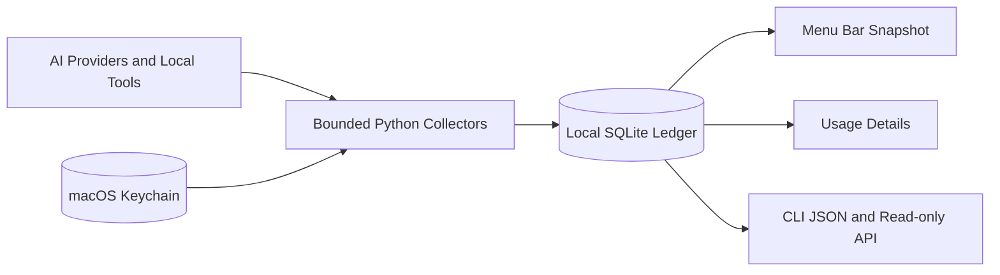

<div align="center">

# OpenUsage Bar

**See AI subscription capacity, token activity, and API spend at a glance.**

A native macOS menu-bar utility. Data stays local; people read the UI and schedulers read JSON.

[](https://github.com/tttboy123/openusage-bar/releases)


[中文](README.md) | [Local API](docs/api/local-api-v1.md) | [Provider support](docs/provider-support.md) | [Install](docs/release-quick-start.md)

</div>

OpenUsage Bar is a local-first native macOS dashboard for AI subscriptions, API providers, local coding tools, and daily token activity.

<p align="center">
  
</p>

<p align="center"><sub>Real SwiftUI interface rendered from an isolated synthetic ledger. No user ledger, Keychain data, or real quota was read.</sub></p>

> Current version: **0.3.0 pre-release**. Apple Silicon and macOS 15 or later are required. Developer ID notarization is not available yet; read the Gatekeeper note before installing a downloaded build, or build from source.

## What it does

- Menu bar: today token total, urgent capacity, refresh state, and details entry.
- Activity app: overview, token activity, capacity, API spend, local tools, providers, accounts, and data health.
- Provider center: add, edit, hide, restore, and manage multiple accounts without echoing credentials.
- Local automation surface: stable CLI JSON/JSONL and a private read-only Unix-socket API.
- Privacy boundary: credentials stay in macOS Keychain; prompts, responses, raw provider payloads, cookies, sessions, and direct account identity are not exported.



## Quick install

Download the macOS arm64 ZIP and matching checksum from GitHub Releases:

```bash
shasum -a 256 -c OpenUsage-Bar-v0.3.0-macos-arm64.zip.sha256
unzip OpenUsage-Bar-v0.3.0-macos-arm64.zip
cd OpenUsage-Bar-v0.3.0-macos-arm64
scripts/install_app.sh
```

User-local install:

```bash
OPENUSAGE_INSTALL_DIR="$HOME/Applications" scripts/install_app.sh
```

## Build from source

```bash
scripts/bootstrap.sh
scripts/build_app.sh
scripts/install_app.sh
```

Package a release artifact:

```bash
scripts/package_release.sh
```

## Local data and API

- Ledger: `~/.local/state/openusage-bar/activity.sqlite3`
- Unix socket: `~/.local/state/openusage-bar/openusage.sock`
- Provider config: `~/.config/openusage-bar/providers.json`
- Provider visibility: `~/.config/openusage-bar/visibility.json`
- Logs: `~/Library/Logs/OpenUsageBar.*.log`

Supported read-only resources include:

```text
GET /v1/health
GET /v1/schema
GET /v1/summary
GET /v1/capabilities
GET /v1/providers
GET /v1/capacity
GET /v1/activity/daily?from=2026-07-01&to=2026-07-14
GET /v1/costs/daily?from=2026-07-01&to=2026-07-14
GET /v1/quotas/history
GET /v1/sources/status
GET /v1/changes?after=0&limit=100
```

Signed helper JSON:

```bash
HELPER="/Applications/OpenUsage Bar.app/Contents/Helpers/OpenUsage Provider Settings.app/Contents/MacOS/OpenUsage Provider Settings"
"$HELPER" status --format json --offline
"$HELPER" providers --format json --offline
"$HELPER" usage --from 2026-07-01 --to 2026-07-14 --format jsonl --offline
"$HELPER" doctor --format json --offline
```

## Provider support

OpenUsage Bar is an independent repository and release. OpenUsage.sh is an optional CLI data source consumed through validated JSON only; its Go internals, credentials, and release lifecycle are not embedded here.

Version 0.3.0 includes the OpenUsage 0.23.0 provider catalog plus built-in enhancements for MiniMax, StepFun, Codex, Cursor, Kiro, OpenAI Organization, Generic HTTPS Provider, and Custom Daily Token Feed. See [Provider support](docs/provider-support.md).

## License

Apache-2.0. See [LICENSE](LICENSE) and [THIRD_PARTY_NOTICES.md](THIRD_PARTY_NOTICES.md).
