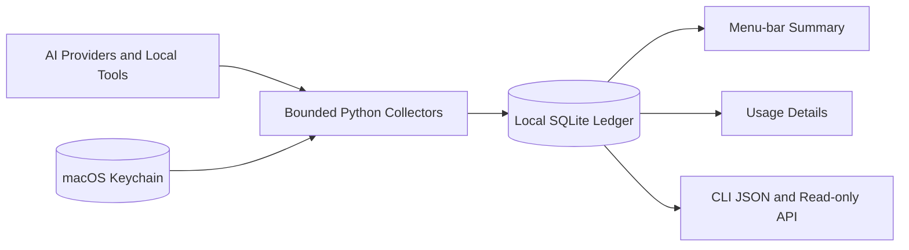
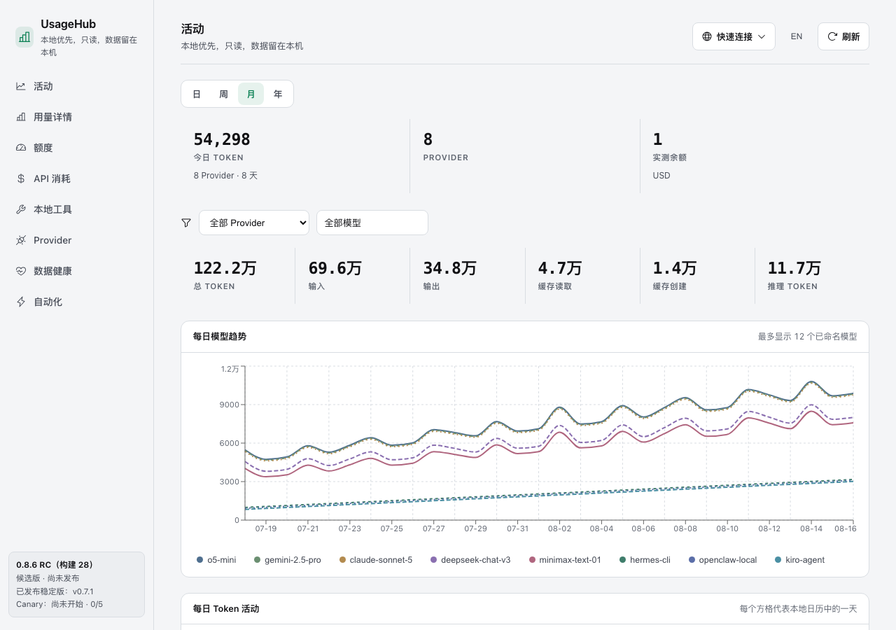
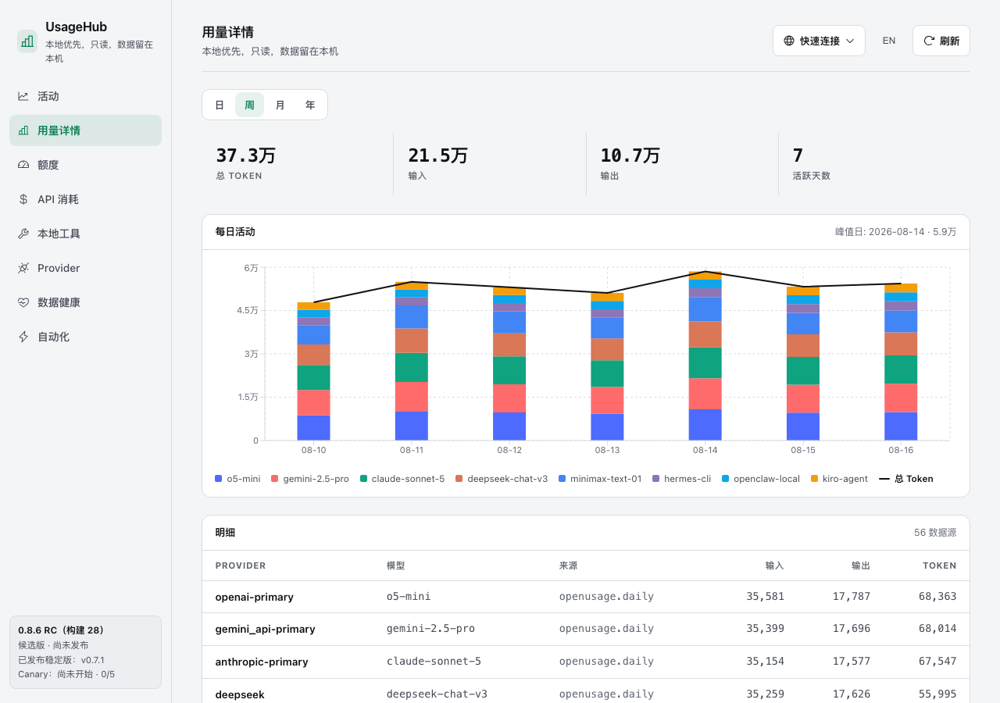
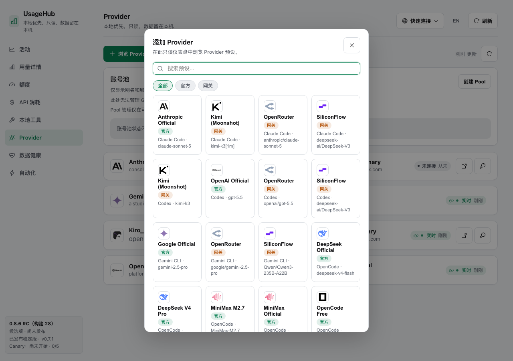
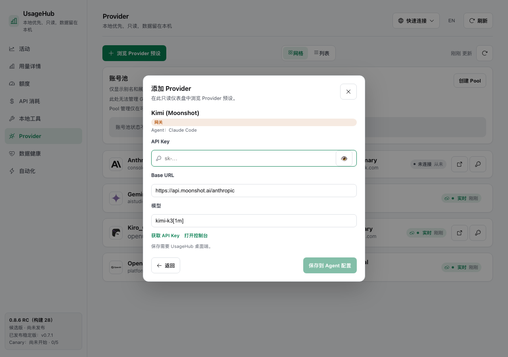

<!-- openusage-release-version: 0.8.7 -->
<!-- openusage-build-identity: product=UsageHub candidate=0.8.7 build=29 channel=rc stage=candidate publication=not_published published=v0.7.1 -->
<div align="center">

# UsageHub

### The All-in-One AI Usage & Provider Manager — Menu-bar Summary · Capacity · API Spend

[](https://github.com/tttboy123/usagehub/releases)
[](https://github.com/tttboy123/usagehub/releases)
[](https://www.electronjs.org/)
[](https://github.com/tttboy123/usagehub/releases/latest)
[](LICENSE)

[中文](README.md) | English | [Changelog](CHANGELOG.md) | [Install guide](docs/release-quick-start.md) | [Provider support](docs/provider-support.md) | [Local API](docs/api/local-api-v1.md)

</div>

## Why UsageHub?

Modern AI coding relies on Claude Code, Codex, Gemini CLI, OpenCode, and many providers — but
usage is scattered: each CLI tool has its own config format, subscription capacity and API
balances live in different provider consoles, and switching providers means hand-editing
JSON/TOML. Nobody brings it together while keeping data local.

**UsageHub** unifies them with a menu-bar summary plus a local dashboard: the menu-bar icon shows
today's usage at a glance, provider presets are verified against each provider's official site and
write straight into the target agent's config, and capacity/balance/API spend/token history are one
click away — all local-first, with credentials only in Keychain.

- **Live menu-bar summary** — today-token count next to the icon (🟢/🟡/🔴 status dot); click for real balances and capacity; double-click opens the dashboard
- **One-click provider onboarding** — pick a preset (official/gateway) → fill API Key / Base URL / model → save → written to that agent's config file; presets verified against official sites
- **Usage, capacity & cost tracking** — stacked daily totals with per-model breakdown, real balances, API spend, and a yearly token heatmap
- **Covers the main agents** — Claude Code, Codex, Gemini CLI, OpenCode, plus Cursor, Kiro, StepFun, MiniMax and other local tools/providers
- **Local-first** — data stays on your machine, credentials only enter Keychain, and a read-only Unix-socket API serves schedulers
- **Cross-platform** — macOS desktop client (Electron + native SwiftUI); Windows/Linux packaging foundations in place


```mermaid
flowchart LR
  A[AI Providers and Local Tools] --> B[Bounded Python Collectors]
  K[(macOS Keychain)] --> B
  B --> D[(Local SQLite Ledger)]
  D --> E[Menu-bar Summary]
  D --> F[Usage Details]
  D --> G[CLI JSON and Read-only API]
```

## Screenshots

|                 Activity / Menu-bar Summary                 |             Usage Details (stacked chart)             |
| :---------------------------------------------------------: | :---------------------------------------------------: |
|                       |  |
|                    Provider preset browse                    |             Provider form (Kimi)                      |
|  |  |

## Features

### Provider Management

- **4 agents × 20+ presets** — Claude Code, Codex, Gemini CLI, OpenCode; official and gateway
  presets whose Base URL, model, console, and API-key links are verified against official docs
- **One-click onboarding (same flow as CC Switch)** — pick a preset (official/gateway) → fill
  API Key / Base URL / model (custom endpoints allowed) → save → written to that agent's config
- Real brand icons, grid/list views, `codex` displayed as **ChatGPT**
- Credentials only go to Keychain; hiding a provider never touches credentials or history

### Menu-bar Summary

- Live today-token count next to the icon (🟢/🟡/🔴 status dot, refreshed every 60 s)
- Click opens a summary menu: today tokens, real balances, capacity; double-click opens the dashboard
- Adaptive brand template icon for light/dark menu bars

### Usage & Cost Tracking

- **Usage details**: stacked daily chart with total + per-model breakdown; per-provider aggregation with multi-select filters
- **Capacity / real balances**: Codex, Cursor, Kiro, MiniMax, StepFun, Moonshot and more when authoritative data is available
- **API spend**: OpenAI Organization, Generic HTTPS Provider, Custom Daily Token Feed
- **Auto-refresh on open**: opening the app refreshes all data and backfills up to 364 days of history

### Local Tools Coverage

- Claude Code (`claude-sonnet-5`), Codex (`gpt-5.5`), Gemini CLI (`gemini-2.5-pro`), OpenCode (`deepseek-v4-flash` and more)
- Cursor, Kiro, StepFun Step Plan, MiniMax, Moonshot/Kimi, OpenAI Organization

### Privacy & Security

- Credentials only enter Keychain; SQLite/JSON/logs/Local API never contain API keys, cookies, sessions, prompts, or responses
- Data stays local; read-only Unix-socket API (`0700` dir + `0600` socket), no TCP listener by default
- Unknown quota stays unknown — never faked as zero; provider subprocesses use a minimal allowlist environment with timeouts

### Platform

- **macOS**: desktop client (Electron wrapping the local web dashboard) + native SwiftUI menu-bar build
- **Windows / Linux**: Observer packaging and service registration foundations ready (candidate stage)
- Dark/light theme, zh/en UI

## FAQ

<details>
<summary><strong>Which agents/tools does UsageHub support?</strong></summary>

Provider config for **Claude Code**, **Codex**, **Gemini CLI**, and **OpenCode**; usage tracking
for Cursor, Kiro, StepFun Step Plan, MiniMax, Moonshot/Kimi, OpenAI Organization and more.

</details>

<details>
<summary><strong>Where do presets write?</strong></summary>

Per agent:

- **Claude Code** → `~/.claude/settings.json` (`ANTHROPIC_BASE_URL` / `ANTHROPIC_AUTH_TOKEN` / `ANTHROPIC_MODEL`)
- **Codex** → `~/.codex/config.toml` (`model_providers`)
- **Gemini CLI** → `~/.gemini/settings.json` (`GOOGLE_API_KEY` / `GOOGLE_GEMINI_MODEL`)
- **OpenCode** → `~/.config/opencode/opencode.json` (`provider` / `model`)

Credentials are written to the system Keychain by the desktop host and never reach the renderer.

</details>

<details>
<summary><strong>Do I need to restart the terminal after switching?</strong></summary>

Most CLI tools need a terminal/session restart to pick up changes. Writes are atomic and never
corrupt existing configs.

</details>

<details>
<summary><strong>Where is my data stored?</strong></summary>

- Ledger: `~/.local/state/openusage-bar/activity.sqlite3`
- Unix socket: `~/.local/state/openusage-bar/openusage.sock`
- Provider config: `~/.config/openusage-bar/providers.json`
- Logs: `~/Library/Logs/OpenUsageBar.*.log`

</details>

<details>
<summary><strong>Why is the menu-bar icon missing?</strong></summary>

The tray icon only shows while the app is running — open UsageHub (or let it auto-start at login).
Versions before 0.8.6 had a tray-icon path bug that made it invisible; 0.8.6 fixed it with a bundled
brand template icon.

</details>

<details>
<summary><strong>macOS says “UsageHub is damaged” — what now?</strong></summary>

This open-source pre-release is not notarized with an Apple Developer ID; the warning comes from
the download quarantine, not a failed checksum. After verifying the source, run:

```bash
xattr -dr com.apple.quarantine "/Applications/UsageHub.app"
```

Remove quarantine for this app only; do not disable Gatekeeper system-wide.

</details>

## Documentation

- [Install guide](docs/release-quick-start.md) — install, verify, roll back, uninstall
- [Provider support](docs/provider-support.md) — adapter matrix and provider-config presets
- [Local API v1](docs/api/local-api-v1.md) — read-only interface for schedulers
- [Open-source audit](docs/open-source-audit.md) — open-source readiness review record

## Quick Start

### Onboard a provider (same flow as CC Switch)

1. **Pick a preset**: **Provider → Browse provider presets**, choose official or gateway
2. **Fill in**: API Key / Base URL / model (custom endpoints allowed)
3. **Save**: writes to that agent's config file
4. **Apply**: restart your terminal or the CLI tool
5. **Back to official**: pick an official preset and re-run its login/OAuth flow

### Daily use

1. **Menu-bar summary**: click the icon for today tokens, real balances, capacity; double-click opens the dashboard
2. **Usage details**: per-day totals + per-model breakdown, capacity history, API spend
3. **Auto-refresh**: opening the app refreshes all data and backfills history

## Download & Installation

### System requirements

- **macOS**: macOS 15 or later, Apple Silicon (arm64)

### macOS

Grab the latest `UsageHub-0.8.7-mac-arm64.dmg` from [Releases](https://github.com/tttboy123/usagehub/releases),
open it, and drag **UsageHub** into **Applications**. First launch registers the login item and
bundled collector; the menu-bar icon immediately shows today's usage summary.

Native SwiftUI build: [OpenUsage-Bar-v0.8.7-macos-arm64.dmg](https://github.com/tttboy123/usagehub/releases/download/v0.8.7/OpenUsage-Bar-v0.8.7-macos-arm64.dmg) (available after candidate publication).

> 0.8.7 is a candidate pre-release without Developer ID notarization; Windows/Linux installers
> ship with the cross-platform release.

## Development

```bash
scripts/bootstrap.sh
scripts/build_app.sh          # native SwiftUI build
cd desktop && npm run dist:mac  # desktop client (current release form)
```

Quality gates: full Python tests, web typecheck + tests + production build, Swift tests and
coverage, privacy/secret scans, and release-metadata verification. See
[CONTRIBUTING.md](CONTRIBUTING.md).

## Project Structure

```text
├── openusage_bar/          # Python Collector: ledger, provider adapters, read-only API
├── swift_app/              # Native SwiftUI menu-bar build (maintained in parallel)
├── desktop/                # Electron desktop client (current release form)
├── web/                    # Web dashboard (Activity / Usage Details / Capacity / API Spend / Providers / Data Health)
├── scripts/                # Build, audit, and release scripts
├── docs/                   # Documentation (install, API, providers, open-source audit)
└── tests/                  # Python / Web / Swift tests
```

## Contributing

Issues and pull requests are welcome. Before submitting a PR, ensure
`scripts/release_secret_scan.py --history` passes, all Python/Web/Swift tests are green, and no
real keys or credentials are committed. See [CONTRIBUTING.md](CONTRIBUTING.md) and
[SECURITY.md](SECURITY.md).

## License

[Apache License 2.0](LICENSE). Runtime dependencies and interop boundaries are listed in
[THIRD_PARTY_NOTICES.md](THIRD_PARTY_NOTICES.md).
