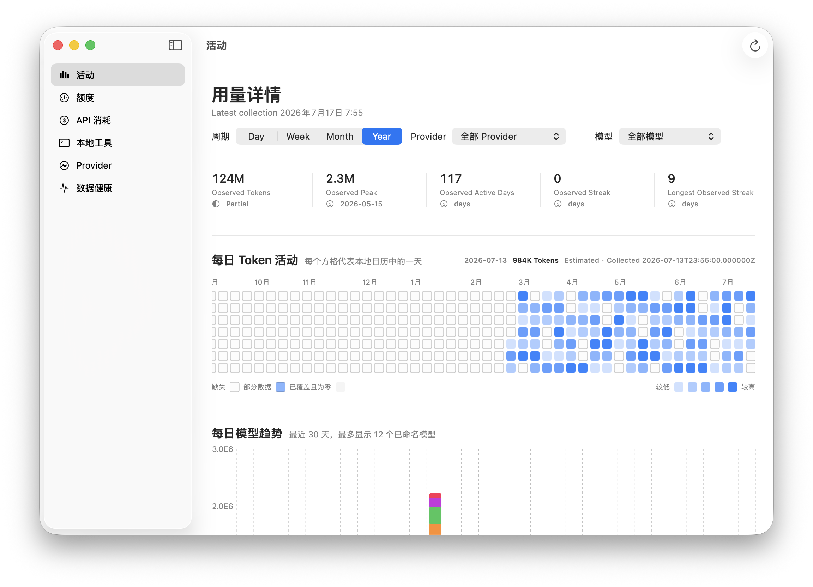
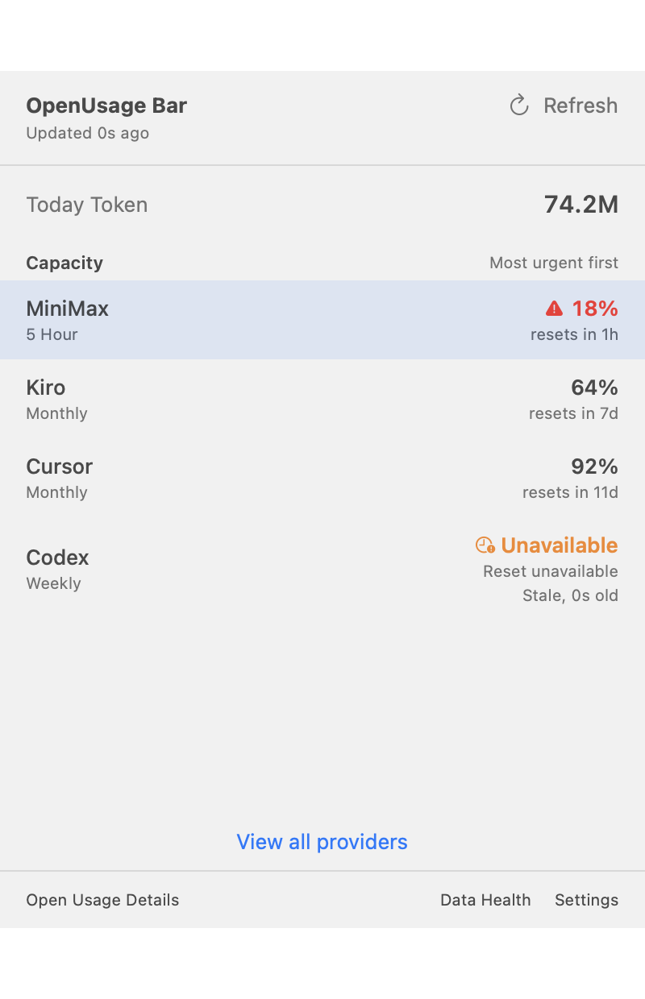
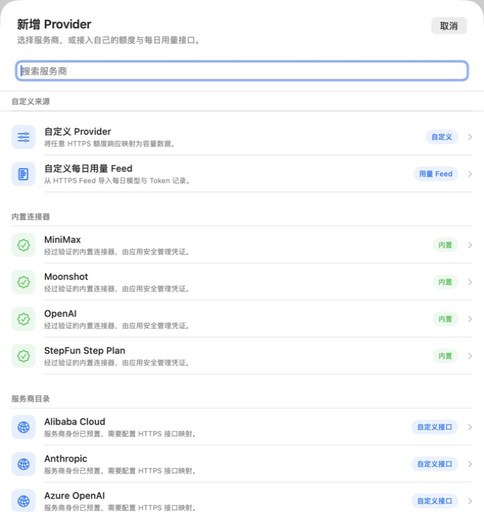
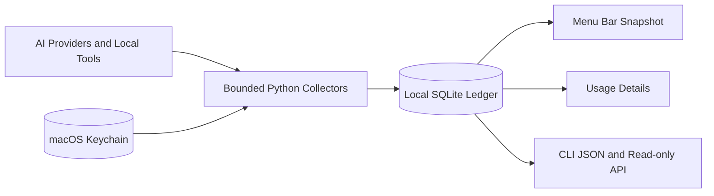

<!-- openusage-release-version: 0.6.0 -->
<div align="center">


# OpenUsage Bar

### A local AI resource console for macOS

**Think iStat Menus for AI accounts and subscriptions: native UI for people, trustworthy JSON for schedulers.**

[](https://github.com/tttboy123/openusage-bar/releases)


[](https://github.com/tttboy123/openusage-bar/actions/workflows/ci.yml)

[Download](https://github.com/tttboy123/openusage-bar/releases) · [Install](docs/release-quick-start.md) · [Provider support](docs/provider-support.md) · [Local API](docs/api/local-api-v1.md) · [中文](README.md)

</div>

<p align="center">
  
</p>

<table>
  <tr>
    <td width="36%" align="center">
      <br>
      <sub><b>Menu bar</b> · today tokens and urgent capacity</sub>
    </td>
    <td width="64%" align="center">
      <br>
      <sub><b>Provider Center</b> · built-ins, custom endpoints, and discovery</sub>
    </td>
  </tr>
</table>

<p align="center"><sub>Real SwiftUI surfaces. Activity and menu-bar images use isolated synthetic ledgers; the Provider image contains only the static service catalog. No user ledger, Keychain item, account, or live quota was read.</sub></p>

## One ledger, four product surfaces

| Surface | Purpose |
| --- | --- |
| **Menu bar** | Today tokens, remaining subscription capacity, reset time, and freshness |
| **Usage Details** | Daily/weekly/monthly activity, token breakdowns, model trends, quota history, and spend |
| **Provider Center** | Built-in providers, multiple accounts, custom HTTPS mappings, usage feeds, and visibility |
| **Local API / CLI** | Versioned facts, source, quality, timestamps, and `dataRevision` for schedulers such as Loom |

Missing facts remain `Unknown` with a reason; they are never fabricated as zero. Credentials stay in Keychain, the ledger stays in SQLite, and TCP listening is disabled by default. OpenUsage Bar remains fully useful without Loom or any other scheduler.

> Current public pre-release: **0.6.0 RC**, for the opt-in, no-telemetry
> external Canary. The qualifying external cohort remains **0 / 5** and the
> 30-day clock is **`not_started`**; follow
> [Canary tracking issue #33](https://github.com/tttboy123/openusage-bar/issues/33)
> for current state. Apple Silicon and macOS 15 or later are required.
> Developer ID notarization is not available yet; if macOS reports the app as
> damaged, remove the download quarantine from this app only as described
> below.

## What it does

- Menu bar: today token total, urgent capacity, refresh state, and details entry.
- Activity app: token activity, capacity, API spend, local tools, providers, accounts, and data health.
- Provider center: add, edit, hide, restore, and manage multiple accounts without echoing credentials.
- Local automation surface: stable CLI JSON/JSONL and a private read-only Unix-socket API.
- Privacy boundary: credentials stay in macOS Keychain; prompts, responses, raw provider payloads, cookies, sessions, and direct account identity are not exported.


```mermaid
flowchart LR
  A[AI Providers and Local Tools] --> B[Bounded Python Collectors]
  K[(macOS Keychain)] --> B
  B --> D[(Local SQLite Ledger)]
  D --> E[Menu Bar Snapshot]
  D --> F[Usage Details]
  D --> G[CLI JSON and Read-only API]
```

## Quick install

[Download OpenUsage Bar v0.6.0 DMG for Apple Silicon](https://github.com/tttboy123/openusage-bar/releases/download/v0.6.0/OpenUsage-Bar-v0.6.0-macos-arm64.dmg)

1. Open the downloaded DMG.
2. Drag **OpenUsage Bar** onto **Applications**.
3. Open it from Finder's Applications folder. The app registers its login item
   and bundled collector automatically; Terminal is not required.

If macOS says **“OpenUsage Bar is damaged”**, verify that the DMG came from this
repository and matches its SHA-256 file, then remove quarantine from this app
only:

```bash
xattr -dr com.apple.quarantine "/Applications/OpenUsage Bar.app"
```

Open it again from Applications. This does not disable Gatekeeper system-wide.
The DMG also includes the same bilingual installation guide. If background
access needs approval, allow OpenUsage Bar in **System Settings > General >
Login Items**.

The ZIP, checksums, transactional installer, rollback, and uninstall scripts
remain available on the release page for advanced repair and automation. See
the [install guide](docs/release-quick-start.md).

## Build from source

```bash
scripts/bootstrap.sh
scripts/build_app.sh
scripts/install_app.sh
```

Package a release artifact:

```bash
scripts/package_release.sh
```

## Local data and API

- Ledger: `~/.local/state/openusage-bar/activity.sqlite3`
- Unix socket: `~/.local/state/openusage-bar/openusage.sock`
- Provider config: `~/.config/openusage-bar/providers.json`
- Provider visibility: `~/.config/openusage-bar/visibility.json`
- Logs: `~/Library/Logs/OpenUsageBar.*.log`

Supported read-only resources include:

```text
GET /v1/health
GET /v1/schema
GET /v1/schema.json
GET /v1/summary
GET /v1/snapshot
GET /v1/capabilities
GET /v1/providers
GET /v1/capacity
GET /v1/activity/daily?from=2026-07-01&to=2026-07-14
GET /v1/costs/daily?from=2026-07-01&to=2026-07-14
GET /v1/quotas/history
GET /v1/sources/status
GET /v1/changes?after=0&limit=100
GET /v1/runtime/summary?windowSeconds=3600
```

`/v1/runtime/summary` reads the separate 24-hour Runtime Ledger and returns a
bounded, content-free summary of tokens, status, cost, and latency. It carries
both the Local API `dataRevision` and the independent `runtimeRevision`; they
are not one transaction. A missing or unsafe Runtime database returns the
sanitized `503 runtime_unavailable` response instead of a fabricated zero.

Signed helper JSON:

```bash
APP="/Applications/OpenUsage Bar.app"
[[ -d "$APP" ]] || APP="$HOME/Applications/OpenUsage Bar.app"
HELPER="$APP/Contents/Helpers/OpenUsage Provider Settings.app/Contents/MacOS/OpenUsage Provider Settings"
"$HELPER" status --format json --offline
"$HELPER" providers --format json --offline
"$HELPER" usage --from 2026-07-01 --to 2026-07-14 --format jsonl --offline
"$HELPER" doctor --format json --offline
```

## Local smart routing (development)

The 0.8 development branch adds a separate content-free Route Decision API and
an optional, disabled-by-default loopback chat proxy. OpenUsage Bar remains
fully usable as a menu-bar resource console when both surfaces are disabled;
neither feature depends on Loom.

Provider Center can explicitly reuse inference credentials already managed for
MiniMax, Kimi/Moonshot, and Step Plan. The Python Controller owns the fixed
China/international endpoint and copies the secret into an isolated routing
Keychain account only after confirmation. SwiftUI submits only the Provider,
model IDs, and enabled state; it never receives a credential. OpenAI
organization admin keys, quota-only generic Providers, and daily usage feeds
are excluded from inference reuse. See [Route Decision API v1](docs/routing-api-v1.md).

## Provider support

OpenUsage Bar is an independent repository and release. OpenUsage.sh is an optional CLI data source consumed through validated JSON only; its Go internals, credentials, and release lifecycle are not embedded here.

Version 0.6.0 includes the OpenUsage 0.23.0 provider catalog plus built-in enhancements for MiniMax, StepFun, Codex, Cursor, Kiro, OpenAI Organization, Generic HTTPS Provider, and Custom Daily Token Feed. See [Provider support](docs/provider-support.md).

## License

Apache-2.0. See [LICENSE](LICENSE) and [THIRD_PARTY_NOTICES.md](THIRD_PARTY_NOTICES.md).
