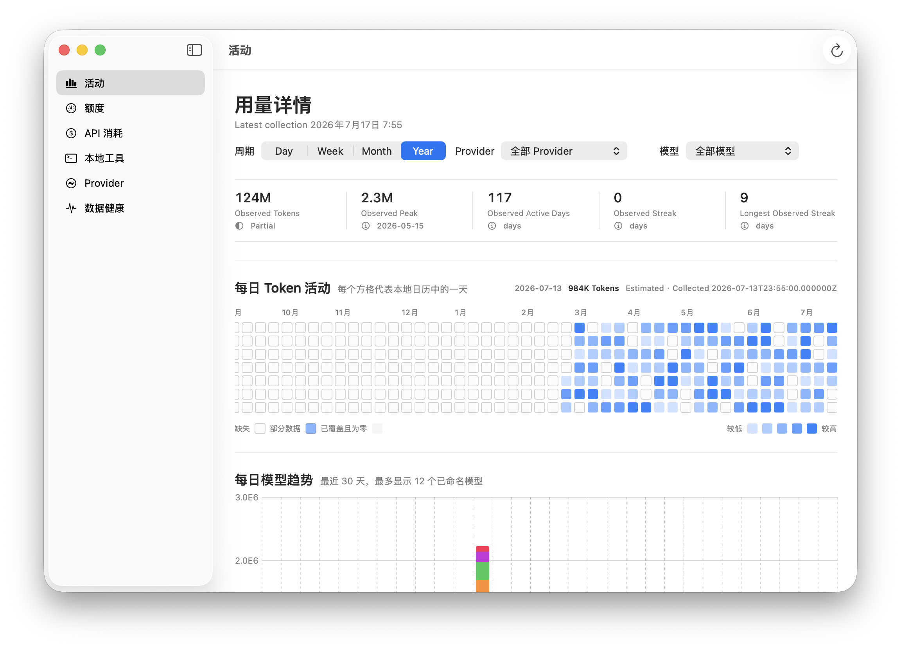
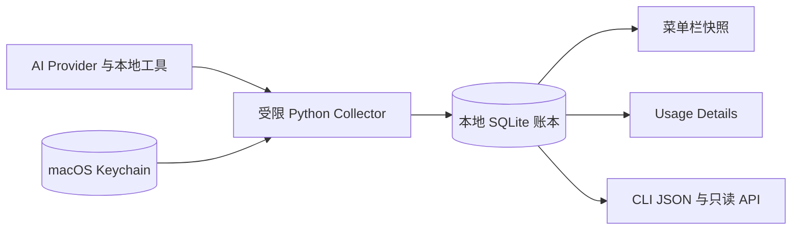

<div align="center">

# OpenUsage Bar

**一眼掌握 AI 订阅余量、Token 活动与 API 消耗。**

原生 macOS 菜单栏工具。数据留在本机，人看界面，调度器读 JSON。

[](https://github.com/tttboy123/openusage-bar/releases)


[English](README.en.md) | [本地 API](docs/api/local-api-v1.md) | [Provider 支持](docs/provider-support.md) | [安装指南](docs/release-quick-start.md)

</div>

OpenUsage Bar 把 AI 订阅额度、API 消耗、本地编码工具和每日 Token 活动统一到一个原生 SwiftUI 客户端里：菜单栏用于快速判断，详情页用于分析，CLI JSON 和本地只读 API 供调度平台读取。

<p align="center">
  
</p>

<p align="center"><sub>真实 SwiftUI 界面，使用隔离的合成账本生成。未读取用户账本、Keychain 或真实额度。</sub></p>

> 当前版本：**0.3.0 预发布版**。支持 Apple Silicon Mac 与 macOS 15 或更高版本。暂未提供 Apple Developer ID 公证包；下载构建请阅读 Gatekeeper 说明，或直接从源码构建。

## 为什么需要它

AI 工具越来越多，但用量信息分散在不同地方：

- Codex、Cursor、Kiro 这类订阅型工具关心剩余额度和重置周期。
- MiniMax、StepFun、OpenAI Organization 这类 Provider 关心套餐余量、账单和 API 消耗。
- Claude Code、OpenCode、Hermes、OpenClaw 等本地工具关心本地活动和 Token 历史。
- 自动调度平台需要结构化数据，而不是去解析 UI 文本。

OpenUsage Bar 的定位很明确：

```text
菜单栏：给人看，快速判断今天还能不能继续跑。
详情页：给人分析，看每日 Token、模型趋势、额度历史和数据健康。
本地 API：给调度系统读，稳定 JSON，不依赖 UI 文案。
Keychain：放密钥；SQLite：放账本；日志：不放凭证。
```



## 核心能力

| 能力 | 说明 |
| --- | --- |
| 菜单栏总览 | Today Token、最紧急 Capacity、刷新状态和详情入口 |
| Usage Details | Overview、Activity、Capacity、API Spend、Local Tools、Providers、Data Health |
| 每日 Token 活动 | 日、周、月、年维度聚合；支持每日总量、模型堆叠趋势和年度方格热力图 |
| Provider Center | 添加、编辑、隐藏、恢复 Provider；支持多账号；凭证只写入 Keychain |
| 订阅额度 | Codex、Cursor、Kiro、MiniMax、StepFun 等可用时显示真实剩余容量 |
| API 消耗 | OpenAI Organization、Generic HTTPS Provider、Daily Token Feed 等结构化接入 |
| 调度接口 | Unix socket 本地只读 API、CLI JSON/JSONL、离线快速读取 |
| 隐私边界 | 不导出 API Key、Cookie、Session、Prompt、Response 或直接账号身份 |

## 快速安装

从 GitHub Releases 下载 macOS arm64 ZIP 和对应 `.sha256` 文件，放在同一个目录后先校验：

```bash
shasum -a 256 -c OpenUsage-Bar-v0.3.0-macos-arm64.zip.sha256
unzip OpenUsage-Bar-v0.3.0-macos-arm64.zip
cd OpenUsage-Bar-v0.3.0-macos-arm64
scripts/install_app.sh
```

无管理员权限时安装到用户目录：

```bash
OPENUSAGE_INSTALL_DIR="$HOME/Applications" scripts/install_app.sh
```

首次打开后：

1. 点击菜单栏里的 **OpenUsage Bar**。
2. 进入 **Open Usage Details** 查看账本。
3. 进入 **Settings / Providers** 添加或编辑 Provider。
4. 如果下载包未公证，在 **System Settings > Privacy & Security** 中仅允许该 App；不要关闭 Gatekeeper。

更多细节见 [release quick start](docs/release-quick-start.md)。

## 从源码构建

需要 Xcode 命令行工具、Swift Package Manager、Python 3.11 或更高版本。

```bash
scripts/bootstrap.sh
scripts/build_app.sh
scripts/install_app.sh
```

构建流程会执行：

- Python 与 Swift 测试
- Provider catalog 一致性检查
- Python 与 Swift 关键模块覆盖率门禁
- 凭证与隐私扫描
- Release 构建与 nested helper 签名
- 安装事务、回滚备份和本地 API 健康检查

生成发布包：

```bash
scripts/package_release.sh
```

## 产品结构

```text
OpenUsage Bar.app
├─ 菜单栏状态宿主：轻量、常驻、只展示关键事实
├─ OpenUsage Activity.app：详情窗口，读取同一份 SQLite 账本
├─ OpenUsage Provider Settings.app：Provider 管理与受控 collector 命令
└─ LaunchAgents
   ├─ com.lune.openusagebar：原生菜单栏宿主
   └─ com.lune.openusagebar.collector：后台采集与本地只读 API
```

本地数据位置：

| 数据 | 路径 |
| --- | --- |
| 活动账本 | `~/.local/state/openusage-bar/activity.sqlite3` |
| Unix socket | `~/.local/state/openusage-bar/openusage.sock` |
| Provider 配置 | `~/.config/openusage-bar/providers.json` |
| Provider 可见性 | `~/.config/openusage-bar/visibility.json` |
| 日志 | `~/Library/Logs/OpenUsageBar.*.log` |
| LaunchAgents | `~/Library/LaunchAgents/com.lune.openusagebar*.plist` |

## 本地 API

默认没有 TCP 监听。调度平台通过 mode `0700` 的 socket 目录和 mode `0600` 的 Unix socket 读取数据。

```text
GET /v1/health
GET /v1/schema
GET /v1/summary
GET /v1/capabilities
GET /v1/providers
GET /v1/providers?providerIds=codex,minimax-primary
GET /v1/capacity
GET /v1/activity/daily?from=2026-07-01&to=2026-07-14
GET /v1/costs/daily?from=2026-07-01&to=2026-07-14
GET /v1/quotas/history
GET /v1/sources/status
GET /v1/changes?after=0&limit=100
```

也可以直接调用签名 helper 输出 JSON：

```bash
HELPER="/Applications/OpenUsage Bar.app/Contents/Helpers/OpenUsage Provider Settings.app/Contents/MacOS/OpenUsage Provider Settings"
"$HELPER" status --format json --offline
"$HELPER" providers --format json --offline
"$HELPER" usage --from 2026-07-01 --to 2026-07-14 --format jsonl --offline
"$HELPER" doctor --format json --offline
```

`--offline` 适合调度器低延迟读取。显式 `--fresh` 和菜单栏 Refresh 共用 90 秒交互尝试上限；超时不会把未知额度写成 0，而是继续提供 last-good ledger 并报告刷新不可用。

## Provider 支持

OpenUsage Bar 是独立仓库和独立发布。OpenUsage.sh 是可选数据源，只通过受限 JSON 接入；它的 Go 内部实现、凭证和发布周期不会嵌入本项目。

- OpenUsage 0.23.0 catalog：覆盖 35 个上游 family。
- 内置增强：MiniMax、StepFun、Codex、Cursor、Kiro、OpenAI Organization、Generic HTTPS Provider、Custom Daily Token Feed。
- MiniMax：订阅额度与延迟 billing feed 分离，当前日缺失不会显示为实时 0。
- StepFun：支持中国站和国际站多账号。
- Generic HTTPS Provider：校验 endpoint、redirect、响应大小和 JSON path。
- Daily Token Feed：支持 range-aware HTTPS JSON、字段映射、分页和 Keychain 鉴权。

完整边界见 [Provider support](docs/provider-support.md)。

## 隐私与安全

OpenUsage Bar 的安全模型是“凭证只进 Keychain，事实才进账本”：

- 不在 SQLite、JSON、JSONL、本地 API、UI 或日志中保存 API Key、Cookie、Session。
- 不采集 Prompt、Response 或直接账号身份。
- Provider 子进程使用最小 allowlist 环境和超时边界。
- 未知额度保持 Unknown，不伪装成 0。
- 隐藏 Provider 只影响展示，不删除凭证或历史账本。

安全问题请按 [SECURITY.md](SECURITY.md) 私密上报，不要公开提交含凭证的 issue。

## 卸载与回滚

临时停止：

```bash
launchctl bootout gui/$(id -u)/com.lune.openusagebar
launchctl bootout gui/$(id -u)/com.lune.openusagebar.collector
```

卸载 App 与 LaunchAgents：

```bash
scripts/uninstall_app.sh
```

连本地账本和配置一起删除：

```bash
scripts/uninstall_app.sh --purge-data
```

Keychain 项不会自动删除。只有确认没有其他本地安装在使用同一 service entry 后，才应该在 Keychain Access 中手动移除。

## 贡献

修改 adapter、账本字段、导出 API 或 Provider 能力前，请先读 [CONTRIBUTING.md](CONTRIBUTING.md)。核心原则：

- SwiftUI 只读展示，Python adapter 负责凭证与账本写入。
- 新 Provider 优先复用现有工具或官方数据源，无法复用再新增 adapter。
- 不新增第三方 UI、图表、数据库、状态管理或依赖注入包。
- 任何 Unknown 都不能被降级成 0。

## License

OpenUsage Bar 使用 [Apache License 2.0](LICENSE)。运行时依赖和互操作边界见 [THIRD_PARTY_NOTICES.md](THIRD_PARTY_NOTICES.md)。
