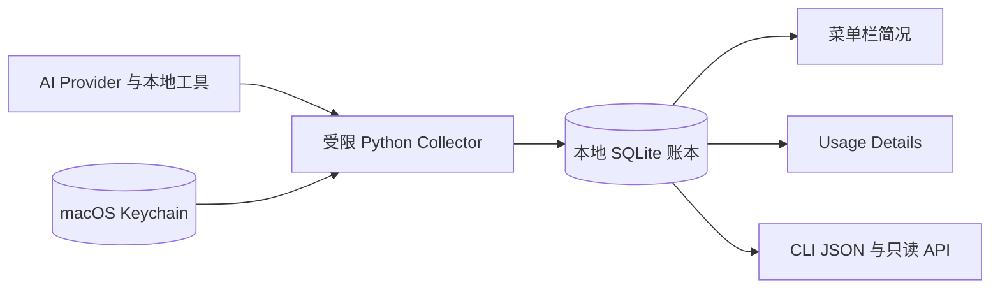

<!-- openusage-release-version: 0.8.6 -->
<!-- openusage-build-identity: product=UsageHub candidate=0.8.6 build=28 channel=rc stage=candidate publication=not_published published=v0.7.1 -->
<div align="center">

# UsageHub

### The All-in-One AI 用量与 Provider 管理工具 — 菜单栏简况 · 额度 · API 消耗

[](https://github.com/tttboy123/openusage-bar/releases)
[](https://github.com/tttboy123/openusage-bar/releases)
[](https://www.electronjs.org/)
[](https://github.com/tttboy123/openusage-bar/releases/latest)
[](LICENSE)

中文 | [English](README.en.md) | [变更日志](CHANGELOG.md) | [安装指南](docs/release-quick-start.md) | [Provider 支持](docs/provider-support.md) | [本地 API](docs/api/local-api-v1.md)

</div>

## 为什么需要 UsageHub？

AI 工具越来越多，但用量信息分散在各处：Claude Code、Codex、Gemini CLI、OpenCode 各有各的
配置文件；订阅额度、API 余额、Token 历史散落在不同 Provider 控制台；每次换 Provider 都要
手改 JSON/TOML。没有人把它们放在一起，还保证"数据只留在本机"。

**UsageHub** 用菜单栏 + 本地仪表盘把它们统一起来：菜单栏图标实时显示今日用量简况，Provider
预设与各官网对齐、一键写入对应 Agent 的配置，额度/余额/API 消耗/Token 历史一目了然——全部
本地优先，凭证只进 Keychain。

- **菜单栏实时简况** — 图标旁直接显示今日 Token（🟢/🟡/🔴 状态点），单击弹出实测余额与额度，双击打开仪表盘
- **Provider 一键接入** — 选预设（官方/网关）→ 填 API Key / Base URL / 模型 → 保存 → 写入该 Agent 的配置文件；预设与各 Provider 官网逐一核对
- **用量、额度与成本追踪** — 每日总量 + 各模型堆叠柱状图、实测余额、API 消耗、年度 Token 热力图
- **覆盖主流 Agent** — Claude Code、Codex、Gemini CLI、OpenCode，以及 Cursor、Kiro、StepFun、MiniMax 等本地工具与 Provider
- **本地优先** — 数据留在本机，凭证只进 Keychain，只读 Unix socket API 供调度平台读取
- **跨平台** — macOS 桌面客户端（Electron + 原生 SwiftUI），Windows/Linux 打包基础已就绪


```mermaid
flowchart LR
  A[AI Provider 与本地工具] --> B[受限 Python Collector]
  K[(macOS Keychain)] --> B
  B --> D[(本地 SQLite 账本)]
  D --> E[菜单栏简况]
  D --> F[Usage Details]
  D --> G[CLI JSON 与只读 API]
```

## Screenshots

|                 活动 / 菜单栏简况                  |                    用量详情（堆叠柱状图）                    |
| :------------------------------------------------: | :----------------------------------------------------------: |
|              |      |
|                  Provider 预设浏览                  |                    Provider 接入表单（Kimi）                  |
|  |  |

## Features

### Provider 管理

- **4 个 Agent × 20+ 预设** — Claude Code、Codex、Gemini CLI、OpenCode；官方与网关预设齐全，
  每个预设的 Base URL、模型、控制台与 API Key 链接均已与官网核对
- **一键接入流程（与 CC Switch 一致）** — 选预设（官方/网关）→ 填 API Key / Base URL / 模型
  （端点可自定义）→ 保存 → 写入该 Agent 的配置文件
- 真实品牌图标、网格/列表视图、`codex` 显示为 **ChatGPT**
- 凭证只写入 Keychain，隐藏 Provider 不影响凭证与历史账本

### 菜单栏简况

- 图标旁实时显示今日 Token（🟢/🟡/🔴 状态点，60 秒自动刷新）
- 单击弹出简况菜单：今日 Token、实测余额、额度；双击打开仪表盘
- 深浅色菜单栏自适应（品牌模板图标）

### 用量与成本追踪

- **用量详情**：每日总量 + 各模型明细的堆叠柱状图，支持按 Provider 聚合与多选筛选
- **额度 / 实测余额**：Codex、Cursor、Kiro、MiniMax、StepFun、Moonshot 等可用时显示真实余量
- **API 消耗**：OpenAI Organization、Generic HTTPS Provider、Daily Token Feed 等结构化接入
- **打开自动刷新**：打开 App 自动刷新全部数据并补齐 364 天历史

### 本地工具覆盖

- Claude Code（`claude-sonnet-5` 等）、Codex（`gpt-5.5`）、Gemini CLI（`gemini-2.5-pro`）、OpenCode（`deepseek-v4-flash` 等）
- Cursor、Kiro、StepFun Step Plan、MiniMax、Moonshot/Kimi、OpenAI Organization 等

### 隐私与安全

- 凭证只进 Keychain，SQLite/JSON/日志/本地 API 均不含 API Key、Cookie、Session、Prompt 或 Response
- 数据留在本机；只读 Unix socket API（`0700` 目录 + `0600` socket），默认不监听 TCP
- 未知额度保持 Unknown，绝不伪装成 0；Provider 子进程使用最小 allowlist 环境与超时边界

### 平台

- **macOS**：桌面客户端（Electron 封装本地 Web 仪表盘）+ 原生 SwiftUI 菜单栏版本
- **Windows / Linux**：Observer 打包基础与系统服务注册已就绪（候选阶段）
- 深色/浅色主题、中英文界面

## FAQ

<details>
<summary><strong>UsageHub 支持哪些 Agent / 工具？</strong></summary>

支持 **Claude Code**、**Codex**、**Gemini CLI**、**OpenCode** 四个 Agent 的 Provider 配置接入；
同时跟踪 Cursor、Kiro、StepFun Step Plan、MiniMax、Moonshot/Kimi、OpenAI Organization 等
本地工具与 Provider 的额度、余额和 Token 活动。

</details>

<details>
<summary><strong>预设保存到哪里？</strong></summary>

按 Agent 写入对应的配置文件：

- **Claude Code** → `~/.claude/settings.json`（`ANTHROPIC_BASE_URL` / `ANTHROPIC_AUTH_TOKEN` / `ANTHROPIC_MODEL`）
- **Codex** → `~/.codex/config.toml`（`model_providers`）
- **Gemini CLI** → `~/.gemini/settings.json`（`GOOGLE_API_KEY` / `GOOGLE_GEMINI_MODEL`）
- **OpenCode** → `~/.config/opencode/opencode.json`（`provider` / `model`）

凭证由桌面宿主写入系统 Keychain，不会出现在渲染端。

</details>

<details>
<summary><strong>切换 Provider 后需要重启终端吗？</strong></summary>

大多数 CLI 工具需要重启终端或重新打开会话才能生效。保存后重启对应 CLI 即可；配置写入是
原子操作，不会破坏既有配置。

</details>

<details>
<summary><strong>我的数据存在哪里？</strong></summary>

- 活动账本：`~/.local/state/openusage-bar/activity.sqlite3`
- Unix socket：`~/.local/state/openusage-bar/openusage.sock`
- Provider 配置：`~/.config/openusage-bar/providers.json`
- 日志：`~/Library/Logs/OpenUsageBar.*.log`

</details>

<details>
<summary><strong>为什么菜单栏看不到图标？</strong></summary>

菜单栏图标只在 App 运行时显示。请确认 App 已打开（或已加入登录项自动启动）。0.8.6 之前
存在托盘图标路径硬编码导致的不可见问题，已在此版本修复：图标现在使用随包携带的品牌模板图标。

</details>

<details>
<summary><strong>macOS 提示“UsageHub 已损坏”怎么办？</strong></summary>

本开源预发布版未使用 Apple Developer ID 公证，提示来自下载隔离属性而非校验失败。确认来源后执行：

```bash
xattr -dr com.apple.quarantine "/Applications/UsageHub.app"
```

仅移除本 App 的隔离属性，不要全局关闭 Gatekeeper。

</details>

## Documentation

- [安装指南](docs/release-quick-start.md) — 安装、校验、回滚、卸载
- [Provider 支持](docs/provider-support.md) — 适配器矩阵与 Provider 配置预设
- [本地 API v1](docs/api/local-api-v1.md) — 调度平台读取的只读接口
- [开源审查](docs/open-source-audit.md) — 开源就绪度审查记录

## Quick Start

### 接入 Provider（与 CC Switch 一致的操作流程）

1. **选预设**：进入 **Provider → 浏览 Provider 预设**，选择官方或网关预设
2. **填参数**：填入 API Key / Base URL / 模型（端点可自定义）
3. **保存**：保存到该 Agent 的配置文件
4. **生效**：重启终端或对应 CLI 工具
5. **回到官方**：选择官方预设后重新登录/OAuth 即可切回

### 日常使用

1. **菜单栏简况**：单击图标查看今日 Token、实测余额与额度；双击打开仪表盘
2. **用量详情**：查看每日总量与各模型明细、额度历史、API 消耗
3. **自动刷新**：打开 App 自动刷新全部数据并补齐历史

## Download & Installation

### 系统要求

- **macOS**：macOS 15 或更高版本，Apple Silicon（arm64）

### macOS

从 [Releases](https://github.com/tttboy123/openusage-bar/releases) 下载最新
`UsageHub-0.8.6-mac-arm64.dmg`，双击打开后把 **UsageHub** 拖入 **Applications**。
首次打开自动注册登录项与后台采集器，菜单栏图标随即显示今日用量简况。

原生 SwiftUI 版本：[OpenUsage-Bar-v0.8.6-macos-arm64.dmg](https://github.com/tttboy123/openusage-bar/releases/download/v0.8.6/OpenUsage-Bar-v0.8.6-macos-arm64.dmg)（候选发布后可用）。

> 0.8.6 为候选预发布，未做 Developer ID 公证；Windows/Linux 安装包随跨平台发布提供。

## Development

```bash
scripts/bootstrap.sh
scripts/build_app.sh          # 原生 SwiftUI 版本构建
cd desktop && npm run dist:mac  # 桌面客户端（当前发布形态）
```

质量门禁：Python 全量测试、Web 类型检查 + 测试 + 生产构建、Swift 测试与覆盖率、隐私/密钥扫描、
发布元数据校验。详见 [CONTRIBUTING.md](CONTRIBUTING.md)。

## Project Structure

```text
├── openusage_bar/          # Python Collector：账本、Provider 适配、只读 API
├── swift_app/              # 原生 SwiftUI 菜单栏版本（同步维护）
├── desktop/                # Electron 桌面客户端（当前发布形态）
├── web/                    # Web 仪表盘（活动 / 用量详情 / 额度 / API 消耗 / Provider / 数据健康）
├── scripts/                # 构建、审计、发布脚本
├── docs/                   # 文档（安装、API、Provider、开源审查）
└── tests/                  # Python / Web / Swift 测试
```

## Contributing

欢迎提交 Issue 与 PR。提交 PR 前请确保：`scripts/release_secret_scan.py --history` 通过、
Python/Web/Swift 测试全绿、不提交真实密钥或凭证。详见 [CONTRIBUTING.md](CONTRIBUTING.md)
与 [SECURITY.md](SECURITY.md)。

## License

[Apache License 2.0](LICENSE)。运行时依赖与互操作边界见
[THIRD_PARTY_NOTICES.md](THIRD_PARTY_NOTICES.md)。
