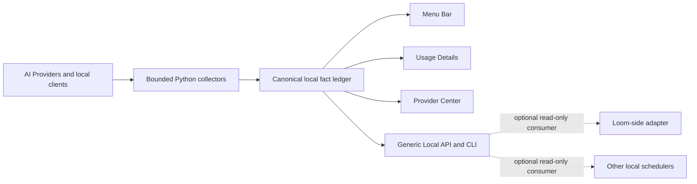

# OpenUsage Bar AI Resource Control Center Implementation Plan

> **For agentic workers:** REQUIRED SUB-SKILL: Use superpowers:subagent-driven-development (recommended) or superpowers:executing-plans to implement this plan task-by-task. Steps use checkbox (`- [ ]`) syntax for tracking.

**Goal:** Turn OpenUsage Bar into a standalone local-first macOS AI resource control center for people and a trustworthy read-only telemetry plane for optional local consumers.

**Architecture:** Python remains the only owner of credentials, provider configuration, collection, and SQLite ledger writes. Native SwiftUI surfaces read sanitized facts; optional consumers read the same facts through a generic versioned Unix-socket API and CLI. OpenUsage Bar has no runtime, build, release, or configuration dependency on Loom. Any Loom adapter lives in the Loom repository and remains a read-only consumer.

**Tech Stack:** Python 3.11+ standard library, SQLite, Swift 6.2, SwiftUI, macOS Keychain, LaunchAgents, HTTP/1.1 over Unix domain sockets, unittest, Swift Testing, GitHub Actions.

---

**Codex skill resolution:** The required `superpowers:executing-plans` workflow is exposed in this environment as the installed `executing-plans` skill. Use that skill for inline execution. Use the subagent-driven option only in a session that exposes `subagent-driven-development`; do not silently install or substitute a different workflow.

## Product decision

OpenUsage Bar is:

> macOS 上的本地 AI 资源控制台——像 AI 账号与订阅的 iStat Menus，同时为调度系统提供统一、可信的数据接口。

The durable product is the local fact ledger. The four user-visible surfaces are:

1. Menu Bar for a two-second decision.
2. Usage Details for historical analysis.
3. Provider Center for discovery, connection, visibility, and multi-account management.
4. Local API/CLI for schedulers and automation.

OpenUsage Bar is complete and independently useful without Loom. Loom is one optional external API consumer, with the same standing as any other local scheduler or automation tool.

## Non-negotiable invariants

- Missing or unsupported facts remain `unknown`; they are never rendered or serialized as zero.
- Subscription capacity, Token activity, monetary cost, and source health remain separate fact families.
- Credentials stay in Keychain, never enter the ledger/API/logs, and are sent to helpers only through bounded stdin.
- Python owns configuration and ledger writes. SwiftUI and every external consumer are read-only.
- OpenUsage Bar must build, install, launch, collect, display, and release without Loom source code, SDKs, configuration, or processes.
- The public API contains generic resource facts only; it never contains Loom Session, task, routing, checkpoint, policy, or context data.
- Every public fact carries provenance, observation time, freshness, quality, and a revision.
- Every quota fact declares whether it applies to a subscription, account, or explicit model set. A broader quota must never be presented as model-specific.
- The API is additive within v1. Removed or retyped fields require a new schema version.
- No cloud account, automatic telemetry upload, model proxy, chat UI, or provider-routing authority is added.
- OpenUsage.sh remains a reusable source, not the product boundary.
- Developer ID signing and notarization are not release gates for the source-first open-source distribution.

## Target architecture



## Authority boundary

| Concern | Authority |
| --- | --- |
| Provider credentials and connection configuration | OpenUsage Bar Python Controller |
| Observed quota, Token, cost, and source-health facts | OpenUsage Bar ledger |
| Consumer goals, policies, routing decisions, bindings, and recovery | Each external consumer |
| Execution lifecycle | The consuming scheduler or harness |
| Predicted/reserved future usage | The consuming scheduler |
| Observed actual usage | OpenUsage Bar |

## Delivery sequence

| Milestone | Release target | Outcome | Exit gate |
| --- | --- | --- | --- |
| M0 Contract foundation | 0.3.x | Complete revisions, coherent snapshot, machine schema, modular ledger files | No public fact can change without a change cursor |
| M1 Control Center beta | 0.4.0 | First-run path, native Provider Center, Automation page, full bilingual UI | First trusted metric in under five minutes |
| M2 Provider platform | 0.5.0 | Registry, fact-specific adapters, multi-window quota, conformance kit | New Provider does not modify central aggregator branches |
| M3 Release candidate to stable | 0.6.0 → 1.0.0 | Upgrade/rollback proof and 30-day external canary | All 1.0 gates in the release plan pass; Loom is not a gate |

## Subsystem plans

- [Core ledger and API](2026-07-18-openusage-core-ledger-api.md)
- [Native product surfaces](2026-07-18-openusage-native-product-surfaces.md)
- [Provider platform](2026-07-18-openusage-provider-platform.md)
- [Release and 1.0 readiness](2026-07-18-openusage-release-readiness.md)
- [Approved Chinese work queue](2026-07-18-openusage-work-queue.zh-CN.md)
- Optional external consumer plan: [Loom resource observer](2026-07-18-openusage-loom-resource-observer.md)

### Task 1: Create an isolated implementation worktree

**Files:**
- Read: `AGENTS.md`
- Read: all plans listed above

- [ ] **Step 1: Confirm the implementation base contains the plans and is clean**

Run:

```bash
git -C /Users/lune/Documents/Codex/2026-07-13/new-chat/work/openusage-bar-public-release status --short
git -C /Users/lune/Documents/Codex/2026-07-13/new-chat/work/openusage-bar-public-release \
  ls-tree -r --name-only HEAD docs/superpowers/plans \
  | rg '^docs/superpowers/plans/2026-07-18-openusage-.*\.md$'
```

Expected: the status command has no output and the tree command lists every approved OpenUsage plan, including the Chinese work queue. If the plans are not committed on the selected base, stop; do not create an implementation worktree from a commit that cannot contain its own instructions.

- [ ] **Step 2: Create the M0 worktree from the exact reviewed base**

Run:

```bash
PLAN_BASE=$(git -C /Users/lune/Documents/Codex/2026-07-13/new-chat/work/openusage-bar-public-release rev-parse HEAD)
git -C /Users/lune/Documents/Codex/2026-07-13/new-chat/work/openusage-bar-public-release \
  worktree add /Users/lune/Documents/Codex/2026-07-13/new-chat/worktrees/openusage-control-center-m0 \
  -b feature/control-center-m0 "$PLAN_BASE"
```

Expected: a new clean worktree on `feature/control-center-m0`; `git rev-parse HEAD` in that worktree equals `PLAN_BASE`, and all six plans are readable there.

- [ ] **Step 3: Record the starting baseline**

Run:

```bash
cd /Users/lune/Documents/Codex/2026-07-13/new-chat/worktrees/openusage-control-center-m0
scripts/bootstrap.sh
scripts/build_app.sh
```

Expected: Python and Swift tests pass, both line-coverage gates remain at least 80%, privacy scans report zero findings, and the app bundle is built and signed with the configured local identity.

### Task 2: Execute M0 data-contract work

**Files:**
- Follow: `docs/superpowers/plans/2026-07-18-openusage-core-ledger-api.md`

- [ ] Complete Tasks 1-5 of the core-ledger plan in order.
- [ ] Run the complete gate after each schema migration task.
- [ ] Do not begin any external consumer adapter until source-health and quota-history changes advance `dataRevision`, appear in `/v1/changes`, and the coherent snapshot contract is stable.

### Task 3: Execute M1 native product work

**Files:**
- Follow: `docs/superpowers/plans/2026-07-18-openusage-native-product-surfaces.md`

- [ ] Land view/repository splits before adding screens.
- [ ] Land bounded Provider mutation before moving Add/Remove into SwiftUI.
- [ ] Complete first-run, Provider Center, Automation, and localization slices independently.
- [ ] Capture English and Simplified Chinese smoke screenshots from the built app.

### Task 4: Execute M2 Provider platform work

**Files:**
- Follow: `docs/superpowers/plans/2026-07-18-openusage-provider-platform.md`

- [ ] Introduce contracts and registry without changing provider output.
- [ ] Migrate one existing adapter family at a time with conformance fixtures.
- [ ] Keep providers without authoritative quota sources at `unknown`.
- [ ] Generate the public support matrix from catalog and runtime contracts.

### Task 5: Execute release hardening and external canary

**Files:**
- Follow: `docs/superpowers/plans/2026-07-18-openusage-release-readiness.md`

- [ ] Complete dependency, artifact, install, upgrade, and rollback gates.
- [ ] Publish source-first ad-hoc signed pre-releases with immutable tags and checksums.
- [ ] Run the opt-in, no-telemetry external canary for 30 days.
- [ ] Publish 1.0 only when every documented gate has evidence.

### Optional external track: Loom integration

**Files:**
- Follow independently in the Loom repository: `docs/superpowers/plans/2026-07-18-openusage-loom-resource-observer.md`

- [ ] Start only after the generic snapshot contract is stable.
- [ ] Keep the first adapter observe-only and disconnected from Scheduler and ProviderRouter.
- [ ] Treat quota guarding and policy routing as later Loom-owned phases with separate authorization.
- [ ] Never make Loom progress a Bar Beta, RC, or 1.0 gate.

## Program-level acceptance metrics

- Median time from first launch to first trustworthy fact is under five minutes.
- Menu Bar shows Today Token and ordered capacity without redundant predictive cards.
- The collector refresh interval remains five minutes and UI revision monitoring remains automatic.
- Every API response contains `schemaVersion`, `dataRevision`, and `generatedAt`.
- Snapshot, CLI JSON, and change-feed fixtures agree on fact identity and revision.
- A stale or unavailable source never becomes a numeric zero.
- Adding a Provider requires a registration plus conformance fixture, not a central `isinstance` branch.
- Any local consumer can read a coherent, versioned resource snapshot without reading SQLite, Keychain, or UI text.
- OpenUsage Bar passes all acceptance and release gates when Loom is absent.
- Upgrade and rollback preserve ledger integrity, revision monotonicity, and Keychain isolation.
