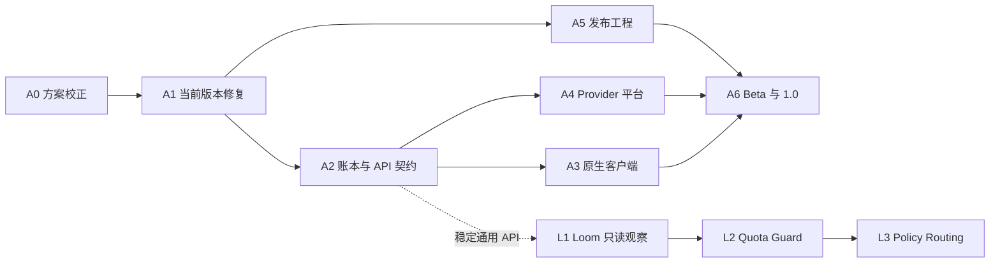

# OpenUsage Bar 中文实施队列

> 状态：已批准，按顺序实施。OpenUsage Bar 是可独立安装和使用的产品；Loom 是可选、只读的外部 API 消费者，不是运行或发布依赖。

## 固定边界

- OpenUsage Bar 在没有 Loom 时仍能完成采集、账本、菜单栏、Usage Details、Provider Center、本地 API 和 CLI 的全部功能。
- OpenUsage Bar 不导入 Loom SDK，不读取 Loom 配置，不包含 Loom Session、任务、路由或上下文数据。
- 本地 API 是通用、版本化、只读的资源事实接口，Loom 与其他本地调度器地位相同。
- Python Controller 继续负责凭证、Provider 配置、网络采集和 SQLite 写入；SwiftUI 只读取脱敏事实并提交受限 mutation 请求。
- 缺失或不支持的事实保持 `unknown`，不得显示或序列化为数值 `0`。
- Loom 的预测消耗、并发预留、checkpoint、暂停和路由策略全部由 Loom 自己负责。

## 依赖顺序



OpenUsage Bar 的 A6 不依赖 L1、L2 或 L3。

## A0：方案校正与基线

**目标：** 把独立产品边界、额度作用域和性能纪律写入可执行计划。

**实施：**

- 从 OpenUsage Bar 的主发布序列中移除 Loom 里程碑。
- 将 Loom 计划标记为独立仓库中的可选消费者计划。
- 将 API 文案中的 Loom 或 admission 专用措辞改成通用 resource consumer facts。
- 在额度事实中增加 `applies_to_kind` 与 `applies_to_model_ids` 的计划和迁移要求。
- 记录当前包体、常驻内存、Activity 生命周期、超时重试和刷新周期基线。
- 从包含全部计划的已提交基线创建独立 worktree，运行完整构建门禁。

**验收：**

- 没有 Loom 时完整构建和运行路径成立。
- 所有实施计划来自同一个已提交 Git 基线。
- 基线 Python、Swift、覆盖率、隐私、签名与打包门禁全绿。

## A1：当前版本稳定性修复

**目标：** 在结构性开发前先修正当前用户可见缺陷，不新增进程或语言。

**实施顺序：**

1. 菜单栏 `View all providers` 打开 Providers，而不是 Capacity。
2. Provider Center 默认选择已连接或需要处理的 Provider，不硬编码 MiniMax 中国站。
3. Activity 最后一个窗口关闭后退出。
4. Cursor 等持续超时来源增加 Provider 级退避和脱敏耗时记录。
5. 建立中英文 key 一致性和新增裸字符串失败门禁。

**验收：**

- 每项先有失败测试，再做最小修复。
- Unknown 不变成零，入口路由与选择行为可重复验证。
- Activity 关闭后不再驻留。
- 重复超时不会形成无条件高频重试。

## A2：统一账本与本地 API 契约

**目标：** 让菜单栏、客户端、CLI 和任意外部消费者读取同一份可验证事实。

**实施顺序：**

1. 纯重构拆分 ledger record、schema 与 store。
2. 让 quota、quota history、source health、coverage、usage、cost 和 Provider instance 的每次公开变化都推进 `dataRevision`。
3. 使用一次 SQLite 读事务生成 `/v1/snapshot`。
4. API 与 CLI 复用同一 QueryService 和 wire serializer。
5. 发布 JSON Schema、Swift 生成常量和跨语言 fixture。
6. 给额度增加明确作用域：

```json
{
  "appliesTo": {
    "kind": "model",
    "modelIds": ["gpt-5.6"]
  }
}
```

允许的作用域至少包括 `subscription`、`account` 和 `model`。账号级额度不得伪装成模型级额度；`unknown` 不携带数值。

**验收：**

- Snapshot 内所有事实共享一个 `dataRevision`。
- Python、API、CLI 与 Swift fixture 对事实身份和数值完全一致。
- API 不包含凭证、直接账号身份、Prompt、响应或 Loom 状态。

## A3：原生客户端

**目标：** 完成 macOS 原生、双语、可访问的日常产品界面。

**实施顺序：**

1. 拆分大型 Swift 文件，保持行为不变。
2. 限制所有 Provider mutation 子进程的输入、输出和超时。
3. 收紧菜单栏为两秒判断界面。
4. 增加首次引导，目标五分钟内出现第一条可信事实。
5. 在 Provider Center 内完成新增、编辑、移除、隐藏和多账号管理。
6. 完成 Usage Details：方形热力格、默认可见最近日期、Top 5 + Other 模型趋势、Unattributed 独立解释、Quota reset 分段。
7. Automation 只作为次级诊断页，展示 API health、schema 和脱敏示例。
8. 将中英文门禁前移到每个功能切片，而不是最后补译。

**验收：**

- 不重新引入重复的 Overview 页面。
- 日常 Provider 管理不依赖旧 Python Settings 窗口。
- 自定义 Feed 放在高级 disclosure 或独立 sheet。
- 英文、简体中文、浅色、深色、键盘和 VoiceOver 路径通过可见验收。

## A4：Provider 平台

**目标：** 以复用优先、事实分离和合规 fixture 的方式扩展 Provider。

**实施顺序：**

1. 建立 Provider contracts 与 runtime registry。
2. 分离 quota、Token usage 与 monetary cost 采集和健康状态。
3. 保存五小时、每周、每月、计费周期和模型级等多个额度窗口及来源。
4. 规范多账号身份，保证账本、Keychain 和查询隔离。
5. 优先复用 OpenUsage、现有 CLI 和已验证开源实现；GLM、Kimi、Qwen、Claude Code、OpenCode 等先增加发现别名，再按权威数据源逐项声明能力。
6. 版本化自定义 quota、usage 和 cost Feed。
7. 建立 Provider Conformance Kit。

**验收：**

- 新 Provider 不增加中央 `isinstance` 分支。
- 一个事实族失败不抑制同 Provider 的其他事实。
- 每个数值携带来源、作用域、窗口、质量、新鲜度和重置时间。
- 没有权威来源的能力保持 `unknown`。

## A5：发布工程

**目标：** 形成源码优先、可审计、可升级回滚的开源分发链路。

**实施：**

- 校验版本、构建号、CHANGELOG 和不可变 Tag。
- GitHub Actions 使用已解析的完整 commit SHA。
- 自动发现 Python 覆盖模块并审计锁定依赖。
- 审计 ZIP 内容，生成 checksum、manifest、SBOM 和 provenance。
- 在隔离 HOME 下证明安装、升级、失败回滚、卸载保留数据和显式 purge。
- 继续使用 ad-hoc 签名便利包；Developer ID 和公证不是开源发布门禁。

**验收：**

- 升级和回滚不降低账本事实数量或 change cursor。
- 回滚不修改 Keychain。
- 发布包不包含用户路径、日志、配置或秘密。

## A6：Beta、Canary 与 1.0

**目标：** 用独立于 Loom 的外部证据完成稳定发布。

**实施：**

- 先发布 0.4 Beta，再按 Provider 平台成熟度推进 0.5 与 0.6 RC。
- 运行无自动遥测的 30 天自愿 Canary。
- 覆盖至少五台 Apple Silicon Mac、不同安装位置和 Provider 配置。
- 只有安装、刷新、重启、升级、回滚和数据完整性门禁全部通过才发布 1.0。

**验收：** Loom 集成不是 Beta、RC 或 1.0 的前置条件。

## L1：Loom Observe-only

**位置：** Loom 独立仓库。

**实施：** 使用受限 Unix Socket Client 读取 `/v1/snapshot`，验证三秒超时、1 MiB 上限、Schema、revision 和额度作用域；将匹配 SessionBinding 的额度记录为 append-only evidence。

**验收：** 不读取 SQLite、Keychain 或 UI，不调用 Scheduler 或 ProviderRouter，不修改 OpenUsage Bar。

## L2：Loom Quota Guard

**目标：** 真正降低额度耗尽造成上下文丢失的风险。

**实施：**

- Loom 根据 SessionBinding 的 Provider、账号和模型匹配适用额度。
- Loom 自己维护预测消耗、并发预留和安全余量。
- 长任务启动前、阶段边界和预计接近阈值时重新检查。
- 软阈值先生成可恢复 checkpoint。
- 硬阈值必须等待 checkpoint 成功后再暂停新阶段。
- stale、unknown 或 API unavailable 不得被当成额度充足。

**验收：** 任何额度触发的暂停前都有可恢复 checkpoint；OpenUsage Bar 仍只提供事实。

## L3：Loom Policy Routing

**目标：** 在单独批准的策略下等待重置或切换账号、模型和 Provider。

**前置：** L1、L2、真实登录 Canary 和明确的策略授权。不得与 Observe-only 阶段混合实施。

## 执行纪律

- 每个行为变化遵循 RED → GREEN → REFACTOR。
- 单任务尽量控制在 1 到 5 个文件；大任务拆成可独立验证的切片。
- 每完成 2 到 3 个任务运行一次完整 Python、Swift、覆盖率、隐私和构建检查点。
- 实施使用独立 worktree；现有用户改动不得被覆盖或回滚。
- 推送、发布、GitHub ruleset 和其他外部写操作需要单独批准。
