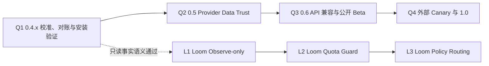

# OpenUsage Bar 中文工作队列

> 状态：当前执行基线，2026-07-19 校准。OpenUsage Bar 是可独立安装和使用的产品；Loom 是可选、只读的外部 API 消费者，不是运行或发布依赖。

## 如何使用本队列

本文件是后续工作的唯一顺序入口。其他 `docs/superpowers/plans/` 文档保留设计、实现和审计细节，但其中未更新的复选框不再代表当前进度。

状态定义：

- **已实现：** 代码已进入仓库并有自动化测试。
- **CI 已验证：** 主分支构建、测试和发布门禁通过。
- **真实环境待验证：** 仓库检查通过，但仍缺真实安装、真实账号或外部用户证据。
- **待实施：** 尚未开始或尚未形成可验收的纵向切片。

任何任务只有同时满足其验收条件和验证步骤，才可以从队列移入“已完成基线”。

## 固定边界

- OpenUsage Bar 在没有 Loom 时仍能完成采集、账本、菜单栏、Usage Details、Provider Center、本地 API 和 CLI 的全部功能。
- OpenUsage Bar 不导入 Loom SDK，不读取 Loom 配置，不包含 Loom Session、任务、路由或上下文数据。
- 本地 API 是通用、版本化、只读的资源事实接口；Loom 与其他本地调度器地位相同。
- Python Controller 继续负责凭证、Provider 配置、网络采集和 SQLite 写入；SwiftUI 只读取脱敏事实并提交受限 mutation 请求。
- 缺失、不完整或不支持的事实保持 `unknown` 或 `partial`，不得显示或序列化成可信数值 `0`。
- 官方数据、OpenUsage fallback 和 Last-good 只能选择一个生效来源，不得把重叠数据相加。
- Loom 的预测消耗、并发预留、checkpoint、暂停和路由策略全部由 Loom 自己负责。
- 1.0 前不整体改写 Python Provider/账本层，不引入 Rust/Go，不扩展 Windows/Linux 客户端。
- Developer ID 与公证可以作为可选分发路径，但不是开源发布门禁。

## 当前完成基线

| 工作域 | 仓库状态 | 仍缺的证据 |
|---|---|---|
| A0 产品边界与方案校正 | 已实现、CI 已验证 | 无 |
| A1 当前用户可见缺陷修复 | 已实现、CI 已验证 | 持续回归验证 |
| A2 统一账本与本地 API v1 | 已实现、CI 已验证 | 真实消费者兼容证据 |
| A3 原生菜单栏、Usage Details、Provider Center、Automation | 已实现、CI 已验证 | 外部机器、双语、键盘和 VoiceOver 可见验收 |
| A4 Provider contracts、registry、多账号、多窗口、Feed、生成能力目录、Conformance Kit | 已实现、CI 已验证 | 每个 Provider 的真实账号与权威数据验证 |
| A5 构建、测试、回滚、Manifest、SBOM、provenance | 仓库实现完成 | GitHub ruleset 与外部 Canary |
| A6 Beta、Canary 与 1.0 | 协议已定义 | 5 台外部 Mac、5 类配置、连续 30 天零阻断事故 |
| L1-L3 Loom 集成 | 仅有独立方案 | 必须在 Loom 仓库单独实施 |

## 后续依赖顺序

```mermaid
flowchart LR
    Q1["Q1 0.4.x 校准、对账与安装验证"] --> Q2["Q2 0.5 Provider Data Trust"]
    Q2 --> Q3["Q3 0.6 API 兼容与公开 Beta"]
    Q3 --> Q4["Q4 外部 Canary 与 1.0"]

    Q1 -. "只读事实语义通过" .-> L1["L1 Loom Observe-only"]
    L1 --> L2["L2 Loom Quota Guard"]
    L2 --> L3["L3 Loom Policy Routing"]
```

OpenUsage Bar 的 Q4 不依赖 L1、L2 或 L3。L1 可以与 0.5 并行，但不能在 Token 与额度事实尚未通过验收时用于生产调度决策。

---

## Q1：0.4.x 状态与发布收尾

### WQ-01：建立唯一 Roadmap 与修正文档漂移

**目标：** 让代码、Tag、CHANGELOG、README、计划和 GitHub 对外状态描述同一件事。

**实施：**

- 新增简洁的根级 `ROADMAP.md`，只保留版本目标、状态和退出门槛。
- 将旧计划标记为 `implemented`、`CI verified`、`live verification pending` 或 `superseded`。
- 修正 README 中重复的 Overview 描述。
- 在 README 补充 `/v1/snapshot` 和 `/v1/schema.json`。
- 把已经包含在已发布版本中、却仍位于 `Unreleased` 下的 CHANGELOG 条目归入首次发布它们的正确版本。

**验收：**

- [x] 一个新贡献者只读 README、ROADMAP 和 CHANGELOG 就能判断当前版本与下一步。
- [x] 已发布能力不再出现在待实施队列中。
- [x] API 文档列出的路由与生成 Schema、实现完全一致。

**验证：** 文档链接检查、`scripts/verify_release_metadata.py`、`git diff --check`。

**依赖：** 无。

**规模：** M，预计 3-5 个文档文件。

### WQ-02：建立公开 GitHub 工作面

**目标：** 让开源用户能看到版本方向、报告问题和认领 Provider 工作。

**实施：**

- 建立 `0.4.x Hardening`、`0.5 Data Trust`、`0.6 RC`、`1.0 Canary` Milestone。
- 将本文件中的可独立任务转成 Issue，并标记依赖、验收和适合贡献者的范围。
- 审查 Dependabot PR #4、#5、#6，只有完整门禁通过才合并。
- 为 `main` 配置要求 CI 通过、禁止强推和保护 Tag 的 ruleset。

**验收：**

- [ ] GitHub 不再以“零 Issue”隐藏真实待办。
- [ ] 自动依赖更新不绕过构建、隐私、覆盖率和发布审计。
- [ ] 受保护分支与 Tag 规则不破坏自动发布流程。

**验证：** GitHub ruleset 只读复查、PR required checks、从临时分支验证 release workflow。

**依赖：** WQ-01。

**规模：** S；包含外部写操作，执行前需要仓库所有者明确批准。

### WQ-03：冻结 Token 统计语义并建立脱敏对账 Fixture

**目标：** 先统一“总量、输入、输出、缓存、计数口径、日期与覆盖范围”的含义，再继续扩 Provider。

**实施：**

- 保留来源报告的 `total`，禁止在未知口径下用 breakdown 重新计算或相加覆盖。
- 为每条日用量声明 `tokenCountingConvention`：`input_includes_cache`、`components_disjoint`、`provider_reported` 或 `unknown`。
- `input_includes_cache` 中 cache read/cache creation 是 input 的分类、reasoning 是 output 的分类，`total = input + output`；`components_disjoint` 中各组件互斥，`total` 为组件和。
- 明确 cache read、cache creation、reasoning token 的独立展示；旧数据与无法证明的上游口径保持 `unknown`，不得猜测。
- 以本地日历日归属事件，覆盖 UTC 跨日、夏令时和 Session 跨日场景。
- 为官方数据、OpenUsage、本地 Session 与 Last-good 建立脱敏 Fixture。
- 明确 `exact`、`estimated`、`fallback`、`partial`、`missing` 的判定规则。

**验收：**

- [x] 同一组 Fixture 在 Python、SQLite、API、CLI 与 Swift 中得到相同的 Token breakdown、来源总量和计数口径。
- [x] UI 与诊断只按已声明口径解释 Total；Cache 不会被二次计入，跨日事件不会落入错误日期。
- [x] 覆盖不完整时返回 `partial`，从未成功时返回 `missing`，两者都不伪装成完整零值。

**验证：** `tests/test_codex_daily.py`、`tests/test_daily_history.py`、`tests/test_openai_organization.py`、`swift_app/Tests/UsageCoreTests/UsageDetailsTests.swift`。

**依赖：** WQ-01。

**规模：** M，每个来源按独立纵向切片提交。

### WQ-04：提供每日 Token 对账与诊断输出

**目标：** 能回答“为什么 7 月 17 日与 ChatGPT 页面不同”，而不是只展示一个总数。

**实施：**

- 按日期、Provider、账号引用和模型输出 Total、Input、Output、Cached Input。
- 同时输出 `sourceId`、`quality`、`coverage`、`importedAt` 和本地时区。
- 标记数据缺口、重复来源候选、跨日归属和 Last-good 使用原因。
- 在 CLI 或独立诊断导出中生成脱敏 JSON；不读取 Prompt、Response、原始 Provider payload 或直接账号身份。
- Usage Details 复用同一事实，在悬浮、键盘焦点和 VoiceOver 中显示一致的来源信息。

**验收：**

- [ ] 任意一天都能追溯总量组成、来源、覆盖状态与采集时间。
- [ ] 诊断结果能够区分“统计口径不同”和“实际丢失/重复数据”。
- [ ] `scripts/privacy_scan.py` 对诊断文件返回零泄漏。

**验证：** 新增专用对账测试、`tests/test_export_diagnostics.py`、Swift Usage Details 测试和隐私扫描。

**依赖：** WQ-03。

**规模：** M，CLI/API 与 UI 分成两个连续切片。

### WQ-05：验证真实安装与后台自动刷新

**目标：** 证明发布包在用户视角可用，不能用“进程正在运行”替代可见结果。

**实施：**

- 从发布 DMG 在干净用户环境安装到 `/Applications`，并覆盖 `~/Applications` 回退路径。
- 确认菜单栏图标实际出现，首次引导和 Provider Center 可打开。
- 不点击菜单栏，等待至少两个五分钟采集周期，确认菜单值和 `dataRevision` 自动推进。
- 重启 Mac，验证登录项、collector、本地 API 和菜单栏恢复。
- 从 N-1 版本升级并执行一次回滚；确认账本事实数、change cursor 和 Keychain 不倒退。

**验收：**

- [ ] 用户可直接确认菜单栏、详情窗口和后台刷新都正常。
- [ ] 手动 Refresh 不是数据更新的必要条件。
- [ ] 安装、升级、重启和回滚后 Unknown 仍不变成 0，历史数据不丢失。

**验证：** `scripts/release_smoke.sh`、`scripts/verify_local_api.py`、安装前后数据库计数与一次人工可见验收。

**依赖：** 可与 WQ-03、WQ-04 并行，0.4.x Checkpoint 前必须完成。

**规模：** M；真实机器验证任务，不以 hermetic 测试代替。

### Checkpoint 0.4.x

- [ ] `scripts/build_app.sh` 通过。
- [ ] `scripts/package_release.sh` 通过。
- [ ] `scripts/release_smoke.sh` 通过。
- [ ] Token 对账能解释至少一个真实差异日期。
- [ ] 干净安装、自动刷新、重启、升级与回滚通过可见验收。
- [ ] 只有存在实际代码或发布修复时才发布下一补丁版。

---

## Q2：0.5 Data Trust 与 Provider 真实能力

### WQ-06：审计 Provider 能力声明并补充真实证据

**目标：** 在已经发布的 Provider catalog、生成能力目录和 `/v1/capabilities` 基础上，区分“代码声明支持”与“真实账号已验证”。

**实施：**

- 审计 Provider catalog、runtime binding、conformance manifest 与现有生成矩阵的一致性。
- 每个 Provider 分别复核 Detection、Token activity、Subscription capacity、API spend。
- 在现有能力声明上补充来源类型、权威程度、账号/模型作用域、刷新窗口和真实验证状态。
- UI、README 和本地 API 继续使用同一份生成数据，不新增第二套手工表格。

**验收：**

- [ ] 搜索别名不再被误解成完整数据支持。
- [ ] 没有权威来源的能力显示 `unsupported` 或 `unknown`。
- [ ] 文档、Provider Center 与 `/v1/capabilities` 内容一致。

**验证：** `tests/test_provider_catalog.py`、`tests/test_capabilities.py`、Swift Provider capability tests。

**依赖：** 0.4.x Checkpoint。

**规模：** M。

### WQ-07：完成 Codex 真实 Token 对账

**目标：** 证明 Codex 本地 Session、OpenUsage 与 ChatGPT/Codex 页面之间的可比范围。

**实施：**

- 对真实脱敏 Session 验证增量读取、模型归属、跨日处理和 Cache 口径。
- 标记本地日志无法覆盖的 Web、移动端、其他设备或已清理历史。
- 禁止把局部本地统计描述成完整 ChatGPT 账号总量。

**验收：**

- [ ] 给定差异日期，可以解释差值来自统计口径、覆盖缺口或实现错误。
- [ ] 本地可覆盖范围内不存在重复 Session 或重复 Cache。
- [ ] 容量窗口与 Token 活动保持独立来源和健康状态。

**验证：** Codex daily/attribution/Fallback 测试、真实脱敏对账报告。

**依赖：** WQ-03、WQ-04、WQ-06。

**规模：** M。

### WQ-08：完成 MiniMax 与 StepFun 真实额度验证

**目标：** 对国内站和国际站分别证明额度、重置与延迟 Billing 语义。

**实施：**

- MiniMax Coding Plan capacity 与延迟 daily billing activity 分开验证。
- StepFun 中国站和国际站 Session 永不跨站重试。
- 多账号分别验证 Keychain、账本作用域、刷新和凭证替换。

**验收：**

- [ ] 当前 Billing 缺失不会变成实时零。
- [ ] 站点、账号、额度窗口和重置时间不会串线。
- [ ] 认证过期时保留 Last-good，并显示准确 Source Health。

**验证：** MiniMax、StepFun、多账号与 conformance 测试，加真实账号脱敏证据。

**依赖：** WQ-06。

**规模：** M，每个 Provider 独立提交。

### WQ-09：完成 Cursor、Kiro 与 OpenAI Organization 验证

**目标：** 证明本地客户端额度、AWS quota、官方组织用量与费用不会互相混淆。

**实施：**

- Cursor 验证剩余百分比、内置命令 PATH、超时退避和 OpenUsage fallback。
- Kiro 验证只读 Keychain、AWS CodeWhisperer quota、计划与重置日期。
- OpenAI Organization 分开验证官方 daily usage 和 billed cost 分页完整性。

**验收：**

- [ ] 任一事实族失败不抑制同 Provider 其他事实。
- [ ] 官方结果与 fallback 不相加，空页和不完整分页不覆盖 Last-good。
- [ ] 多账号、来源、费用与额度作用域保持隔离。

**验证：** `tests/test_aggregator.py`、`tests/test_kiro.py`、`tests/test_openai_organization.py` 和真实账号脱敏证据。

**依赖：** WQ-06。

**规模：** M，每个 Provider 独立提交。

### Checkpoint 0.5-A

- [ ] Codex、MiniMax、StepFun、Cursor、Kiro、OpenAI Organization 均有公开能力声明。
- [ ] 每个展示数值携带来源、质量、作用域、窗口、新鲜度和采集时间。
- [ ] 官方、OpenUsage 与 Last-good 的选择规则通过失败注入。
- [ ] 多账号隔离和 Unknown-not-zero 通过 Provider Conformance Kit。

### WQ-10：验证 Claude Code、OpenCode 与本地工具

**目标：** 对依赖 OpenUsage 或本地日志的工具明确覆盖范围，而不是假设存在官方额度。

**实施：**

- 验证 Claude Code、OpenCode、Hermes、OpenClaw 等本地活动来源。
- 只在可证明时显示 Token；没有订阅额度来源时保持不支持。
- Unattributed 按 Provider 保留，不能猜测成其他模型或厂商。

**验收：** 本地工具不会出现在订阅额度区域，也不会把 Unknown 模型错误归属。

**验证：** OpenUsage catalog fixture、归属测试与本地脱敏样本。

**依赖：** WQ-06。

**规模：** M，按来源类型拆分提交。

### WQ-11：调研并接入 GLM、Kimi 与 Qwen 的权威来源

**目标：** 先确认官方能力，再决定复用或开发，不用搜索别名冒充数据支持。

**实施：**

- 分别核验 Z.AI/GLM、Moonshot/Kimi、Alibaba Cloud/Qwen 的官方只读用量、费用和额度接口。
- 优先复用已发布 OpenUsage JSON；其次使用官方 API；再考虑 Generic/Custom Feed。
- 只有前三条不能保留正确语义时，才新增内置 Adapter。

**验收：**

- [ ] 每个厂商有来源、认证方式、区域、分页、速率限制与隐私审查记录。
- [ ] 无官方能力时明确标记 unsupported，不维护脆弱网页爬虫。
- [ ] 新 Adapter 通过完整 Provider Conformance Kit。

**验证：** 官方文档证据、脱敏 Fixture、失败注入和能力矩阵一致性测试。

**依赖：** WQ-06。

**规模：** 每个厂商先 S 级调研，再决定是否建立 M 级实现任务。

### WQ-12：发布 Provider Adapter Kit

**目标：** 让外部贡献者能复用契约接入 Provider，而不修改中央聚合分支。

**实施：**

- 发布最小 Adapter 示例、manifest、脱敏 Fixture 和 conformance 命令。
- 提供 quota、daily usage、daily cost Feed v2 模板及迁移说明。
- 提供安全清单：Keychain、HTTPS、redirect、分页、响应上限、脱敏错误和 Last-good。
- 增加 Provider 请求模板与贡献文档。

**验收：**

- [ ] 示例 Adapter 在干净 checkout 中通过全部 conformance case。
- [ ] 新 Provider 不增加中央 `isinstance` 或 UI 特判。
- [ ] Fixture、日志和失败输出不含凭证或直接账号身份。

**验证：** `tests/provider_conformance.py`、`tests/test_provider_conformance.py`、隐私扫描和 clean-checkout build。

**依赖：** WQ-06、Checkpoint 0.5-A。

**规模：** M。

### Checkpoint 0.5

- [ ] 第一批 Provider 有真实账号脱敏验证，而不只是合成 Fixture。
- [ ] 第二批 Provider 有明确的权威来源或 unsupported 结论。
- [ ] UI、CLI 与 API 对同一 `dataRevision` 返回一致事实。
- [ ] Provider Adapter Kit 可供新贡献者独立使用。

---

## Q3：0.6 RC、API 稳定与公开 Beta

### WQ-13：加固 Local API v1 兼容策略

**目标：** 在已经发布的 Local API v1、`/v1/snapshot` 和 `/v1/schema.json` 基础上，补齐可执行的兼容承诺。

**实施：**

- 将 `/v1/snapshot`、`/v1/schema.json`、`dataRevision` 和能力 Schema 记录为已发布兼容面。
- 定义 additive、deprecated、breaking 变化规则和版本升级流程。
- 建立 N-1 客户端、未知字段、旧 Schema 与 1 MiB 上限兼容测试。
- 提供最小 Unix socket 客户端示例，不发布 OpenUsage Bar 专用调度 SDK。

**验收：** N-1 客户端可读取当前 Server；不支持的新字段不会破坏旧消费者。

**验证：** Local API schema、CrossLanguageContract、LocalAPIClient 和 release smoke 测试。

**依赖：** Checkpoint 0.5。

**规模：** M。

### WQ-14：复核 Canary 入口并启动公开 Beta

**目标：** 在不收集自动遥测的前提下获得外部真实证据。

**实施：**

- 复核已有 Canary Issue Form、`docs/canary.md`、诊断导出和参与指南与当前 Schema 一致。
- 只修复审计发现的缺口，不重复建设已经存在的 Canary 基础设施。
- 招募至少五台外部 Apple Silicon Mac，覆盖五种 Provider 配置。
- 分配随机、非身份化 Canary label，记录安装、刷新、重启、升级和回滚结果。

**验收：** 第五台合格机器加入后才能启动 30 天时钟。

**验证：** 提交表单只包含聚合诊断；附件通过隐私扫描。

**依赖：** WQ-13。

**规模：** M，包含外部参与者协调。

### WQ-15：建立性能与轻量化决策门槛

**目标：** 用测量决定是否迁移常驻宿主，不因语言偏好重写成熟 Provider 与账本逻辑。

**实施：**

- 测量菜单栏、collector、Activity 的空闲 CPU、内存、唤醒、包体和刷新耗时。
- 单独统计各 Provider 的网络/子进程耗时、超时与退避效果。
- 只有超过已记录阈值时，才评估 Swift 只读 Agent + Python 一次性 collector。
- Python 仍是唯一账本写入者，除非另有独立 ADR、迁移与回滚计划。

**验收：** 任何语言迁移提案都包含现状数据、目标收益、兼容成本和回滚方案。

**验证：** 重复三次的空闲与刷新基线、同版本前后对比；不以单次 `ps` 采样做结论。

**依赖：** 可与 WQ-13、WQ-14 并行。

**规模：** S 级测量；迁移实现必须另立计划。

### Checkpoint 0.6 RC

- [ ] Local API v1 通过 N-1 兼容测试。
- [ ] Beta 安装、升级、回滚和诊断路径有外部参与者验证。
- [ ] 性能满足基线，或已形成独立且可回滚的优化计划。
- [ ] 0.6 RC 仍可在没有 Loom 的机器上独立工作。

---

## Q4：1.0 Canary 与稳定发布

### WQ-16：运行 30 天外部 Canary

**目标：** 用真实环境而不是仓库自测证明稳定性。

**验收：**

- [ ] 至少五台外部 Apple Silicon Mac 和五类 Provider 配置完成全周期。
- [ ] 连续 30 天没有数据丢失、隐私泄漏、Unknown-to-zero、不可恢复升级或 High/Critical 漏洞。
- [ ] 每台机器至少完成一次 N-1 升级和主动回滚。
- [ ] 菜单栏、Usage Details、Provider Center、CLI 与 API 描述同一 revision 和 Source Health。

**验证：** `docs/canary.md` 定义的每机检查与阻断事故规则。

**依赖：** Checkpoint 0.6 RC。

**规模：** 30 个连续日历日；阻断事故会重置时钟。

### WQ-17：发布 1.0

**目标：** 发布可审计、可回滚、仍保持本地优先与开源边界的稳定版本。

**验收：**

- [ ] Canary 全部通过，未关闭或弱化任何安全、隐私、覆盖率门禁。
- [ ] Tag、checksum、manifest、SPDX SBOM、provenance 和 artifact attestation 完整。
- [ ] 依赖审计无已知 High/Critical 漏洞。
- [ ] 安装、卸载、保留数据、显式 purge、升级和回滚文档与包一致。
- [ ] Developer ID 仍为可选分发增强，不阻塞开源 1.0。

**验证：** 完整 CI、release workflow、真实下载包 smoke 和最终文档审计。

**依赖：** WQ-16。

**规模：** M。

---

## Loom 独立并行队列

以下任务只能在 Loom 仓库实施。OpenUsage Bar 只发布通用事实，不导入 Loom 代码。

### L1：Observe-only Client

- 使用受限 Unix socket Client 读取 `/v1/snapshot`。
- 验证 3 秒超时、1 MiB 上限、Schema、revision、Provider/account/model 作用域。
- 将匹配 SessionBinding 的事实记录为 append-only evidence。
- stale、unknown 或 API unavailable 必须 fail closed，但 L1 不暂停任务、不修改路由。

**依赖：** WQ-03 与 WQ-04 的事实语义通过；可与 0.5 Provider 验证并行。

**验收：** 不读取 SQLite、Keychain 或 UI，不调用 Scheduler 或 ProviderRouter，不修改 OpenUsage Bar。

### L2：Quota Guard

- Loom 自己维护预测消耗、并发预留与安全余量。
- 长任务开始前、阶段边界和接近阈值时重新检查。
- 软阈值先生成可恢复 checkpoint；硬阈值必须在 checkpoint 成功后才暂停新阶段。

**依赖：** L1、Checkpoint 0.5 和真实登录 Canary。

**验收：** 任何额度触发的暂停前都有可恢复 checkpoint。

### L3：Policy Routing

- 在单独批准的策略下等待重置，或切换账号、模型和 Provider。
- 不把额度事实直接等同于调度许可；所有策略由 Loom 保存和审计。

**依赖：** L2、并发预留验证、真实任务 Canary 和明确的策略授权。

**验收：** 不得与 Observe-only 阶段混合上线。

## 并行与顺序约束

- WQ-01 与 WQ-03 可以并行；WQ-02 依赖 WQ-01 的公开 Roadmap。
- WQ-05 可与 Token 对账并行，但必须在 0.4.x Checkpoint 前完成。
- WQ-08、WQ-09、WQ-10、WQ-11 在 WQ-06 能力矩阵稳定后并行，且每个 Provider 使用独立提交。
- WQ-12 依赖第一批 Provider 的真实经验，不能只依据合成 Fixture 设计。
- L1 可在事实契约通过后并行开发；L2 和 L3 必须严格串行。
- GitHub 推送、PR 合并、Release、ruleset 和 Canary 外部协调仍是独立外部动作。

## 执行纪律

- 每个行为变化遵循 RED → GREEN → REFACTOR。
- 单任务尽量控制在 1-5 个文件；超过范围时按 Provider、事实族或消费者拆分。
- 每完成 2-3 个任务运行一次 Python、Swift、覆盖率、隐私和构建检查点。
- 实施使用从最新 `origin/main` 创建的独立分支或 worktree；不得覆盖用户已有改动。
- 所有数值变化都要有 Source、Quality、Coverage、Scope、Window、Freshness 与采集时间证据。
- Hermetic 测试只证明仓库行为；真实账号、菜单栏图标、后台刷新和升级回滚必须另做可见验证。
- 未完成真实验证时使用 `PARTIAL` 或 `HUMAN_REQUIRED`，不得宣称生产就绪。
