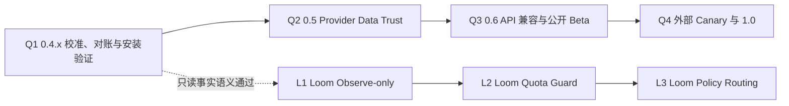

# OpenUsage Bar 中文工作队列

> 状态：当前执行基线，2026-07-19 校准。OpenUsage Bar 是可独立安装和使用的产品；Loom 是可选、只读的外部 API 消费者，不是运行或发布依赖。

## 如何使用本队列

本文件是后续工作的唯一顺序入口。其他 `docs/superpowers/plans/` 文档保留设计、实现和审计细节，但其中未更新的复选框不再代表当前进度。

状态定义：

- **已实现：** 代码已进入仓库并有自动化测试。
- **CI 已验证：** 主分支构建、测试和发布门禁通过。
- **真实环境待验证：** 仓库检查通过，但仍缺真实安装、真实账号或外部用户证据。
- **待实施：** 尚未开始或尚未形成可验收的纵向切片。

任何任务只有同时满足其验收条件和验证步骤，才可以从队列移入“已完成基线”。

## 固定边界

- OpenUsage Bar 在没有 Loom 时仍能完成采集、账本、菜单栏、Usage Details、Provider Center、本地 API 和 CLI 的全部功能。
- OpenUsage Bar 不导入 Loom SDK，不读取 Loom 配置，不包含 Loom Session、任务、路由或上下文数据。
- 本地 API 是通用、版本化、只读的资源事实接口；Loom 与其他本地调度器地位相同。
- Python Controller 继续负责凭证、Provider 配置、网络采集和 SQLite 写入；SwiftUI 只读取脱敏事实并提交受限 mutation 请求。
- 缺失、不完整或不支持的事实保持 `unknown` 或 `partial`，不得显示或序列化成可信数值 `0`。
- 官方数据、OpenUsage fallback 和 Last-good 只能选择一个生效来源，不得把重叠数据相加。
- Loom 的预测消耗、并发预留、checkpoint、暂停和路由策略全部由 Loom 自己负责。
- 1.0 前不整体改写 Python Provider/账本层，不引入 Rust/Go，不扩展 Windows/Linux 客户端。
- Developer ID 与公证可以作为可选分发路径，但不是开源发布门禁。

## 当前完成基线

| 工作域 | 仓库状态 | 仍缺的证据 |
|---|---|---|
| A0 产品边界与方案校正 | 已实现、CI 已验证 | 无 |
| A1 当前用户可见缺陷修复 | 已实现、CI 已验证 | 持续回归验证 |
| A2 统一账本与本地 API v1 | 已实现、CI 已验证 | 真实消费者兼容证据 |
| A3 原生菜单栏、Usage Details、Provider Center、Automation | 已实现、CI 已验证 | 外部机器、双语、键盘和 VoiceOver 可见验收 |
| A4 Provider contracts、registry、多账号、多窗口、Feed、生成能力目录、Conformance Kit | 已实现、CI 已验证 | 每个 Provider 的真实账号与权威数据验证 |
| A5 构建、测试、回滚、Manifest、SBOM、provenance | 仓库实现完成 | GitHub ruleset 与外部 Canary |
| A6 Beta、Canary 与 1.0 | 协议已定义 | 5 台外部 Mac、5 类配置、连续 30 天零阻断事故 |
| L1-L3 Loom 集成 | 仅有独立方案 | 必须在 Loom 仓库单独实施 |

## 后续依赖顺序

```mermaid
flowchart LR
    Q1["Q1 0.4.x 校准、对账与安装验证"] --> Q2["Q2 0.5 Provider Data Trust"]
    Q2 --> Q3["Q3 0.6 API 兼容与公开 Beta"]
    Q3 --> Q4["Q4 外部 Canary 与 1.0"]

    Q1 -. "只读事实语义通过" .-> L1["L1 Loom Observe-only"]
    L1 --> L2["L2 Loom Quota Guard"]
    L2 --> L3["L3 Loom Policy Routing"]
```

OpenUsage Bar 的 Q4 不依赖 L1、L2 或 L3。L1 可以与 0.5 并行，但不能在 Token 与额度事实尚未通过验收时用于生产调度决策。

---

## Q1：0.4.x 状态与发布收尾

### WQ-01：建立唯一 Roadmap 与修正文档漂移

**目标：** 让代码、Tag、CHANGELOG、README、计划和 GitHub 对外状态描述同一件事。

**实施：**

- 新增简洁的根级 `ROADMAP.md`，只保留版本目标、状态和退出门槛。
- 将旧计划标记为 `implemented`、`CI verified`、`live verification pending` 或 `superseded`。
- 修正 README 中重复的 Overview 描述。
- 在 README 补充 `/v1/snapshot` 和 `/v1/schema.json`。
- 把已经包含在已发布版本中、却仍位于 `Unreleased` 下的 CHANGELOG 条目归入首次发布它们的正确版本。

**验收：**

- [x] 一个新贡献者只读 README、ROADMAP 和 CHANGELOG 就能判断当前版本与下一步。
- [x] 已发布能力不再出现在待实施队列中。
- [x] API 文档列出的路由与生成 Schema、实现完全一致。

**验证：** 文档链接检查、`scripts/verify_release_metadata.py`、`git diff --check`。

**依赖：** 无。

**规模：** M，预计 3-5 个文档文件。

### WQ-02：建立公开 GitHub 工作面

**目标：** 让开源用户能看到版本方向、报告问题和认领 Provider 工作。

**实施：**

- 建立 `0.4.x Hardening`、`0.5 Data Trust`、`0.6 RC`、`1.0 Canary` Milestone。
- 将本文件中的可独立任务转成 Issue，并标记依赖、验收和适合贡献者的范围。
- 审查当前全部 Dependabot PR；截至 2026-07-29 为 #5、#10、#11、#12、#13、#14，只有完整门禁通过才合并。
- 为 `main` 配置要求 CI 通过、禁止强推和保护 Tag 的 ruleset。

**2026-07-29 只读审计：**

- GitHub 当前有 0 个普通 Issue、0 个 Milestone、0 个 ruleset；`main` 分支保护接口返回 `404 Branch not protected`。仓库已开启 secret scanning 与 push protection，但公开工作面和发布引用保护尚未建立。
- PR #12、#13、#14 的现有 CI 为成功；PR #5 与 #10 的唯一失败都是远端 `main@9cd134a` 上旧版 `test_official_actions_are_pinned_to_full_commit_shas` 把 Action 版本注释固定为旧 major。两个 PR 实际分别使用 `actions/upload-artifact@043fb46d1a93c77aae656e7c1c64a875d1fc6a0` 和 `actions/setup-python@5fda3b95a4ea91299a34e894583c3862153e4b97`，均为完整 40 位 SHA，不能把这两次失败归类为“未固定 SHA”。
- 本地提交 `72318a2` 先把门禁改为扫描全部 workflow 中的每一个官方 Action 引用，并拒绝任何非完整 40 位 SHA；随后当前分支又增加受控 `.github/action-pins.json`，要求 workflow 的 SHA 与精确 `vX.Y.Z` 注释同时匹配清单，未登记、重复、非完整 SHA、major-only 注释和陈旧清单均失败。本地构建与两条 GitHub workflow 都执行同一验证器。该门禁尚未在远端 `main` 运行，因此 #5 与 #10 需要同时更新受控清单并重跑完整 CI，不能依据本地推断合并。
- 最终工作树的完整本地构建已执行该门禁并通过：`action_pin_verification_ok`、Python 772 项、Swift 251 项、Swift 产品行覆盖率 87.29%、隐私扫描 0、两个原生 release product、冻结设置 Helper 与深度签名全部成功。
- PR #11 的现有 CI 虽为成功，但其标题与 SHA 将 `actions/checkout` 升至 7.0.1，workflow 注释仍保留 `# v5`。这是人类可读元数据漂移；更正注释并在当前基线重跑完整门禁前不合并。
- 本地已补充双语 Provider 接入 Issue Form，并形成可审阅的 Milestone、Issue、ruleset 与授权分界执行草案；工作队列仍是任务与依赖的唯一权威。

**2026-07-29 授权执行：**

- [x] `docs/refresh-work-queue` 已推送并创建 Draft PR [#15](https://github.com/tttboy123/openusage-bar/pull/15)；PR 保留真实重启验收为未完成项。
- [x] 四个 Milestone 已创建；Issue [#16](https://github.com/tttboy123/openusage-bar/issues/16) 至 [#34](https://github.com/tttboy123/openusage-bar/issues/34) 共 19 项已按阶段、标签和依赖发布。
- [x] `Protect main` ruleset 已启用，禁止删除与非快进更新并要求最新 `verify` check 成功；`Protect release tags` 已启用，禁止更新或删除 `v*` Tag。两个 ruleset 均没有默认 bypass actor。
- [x] PR #15 在提交 `c5b2936` 上的首轮远端 `verify` 已完整通过，耗时 8 分 47 秒；构建、打包、制品审计、隔离安装/升级/回滚/卸载与 artifact 上传均成功。该轮唯一注解是旧 `upload-artifact@v4.6.2` 的 Node.js 20 弃用提示。
- [x] 已从官方 Action Tag 重新解析并核验 #5、#10、#11 的提交，将 `upload-artifact@v7.0.1`、`setup-python@v7.0.0` 与 `checkout@v7.0.1` 纳入当前受控清单；版本注释同步为精确 `vX.Y.Z`，不复用 #11 的陈旧 `# v5` 注释。
- [x] Action v7 更新提交 `0f3ac3e` 的远端 `verify` 已完整通过，耗时 7 分 45 秒且不再出现 Node.js 20 弃用注解；最新 Action、完整构建、打包、制品审计、隔离安装/升级/回滚/卸载与 artifact 上传均成功。
- [x] 2026-07-30 再次核对公开仓库：CI 对全部 `pull_request` 触发，
  `verify` 同时执行依赖审计、完整历史密钥扫描、构建与覆盖率、隐私扫描、
  制品审计以及隔离安装/升级/回滚/卸载；`Protect main` 无 bypass actor，
  严格要求最新 `verify`。Dependabot #12、#13、#14 已通过同一门禁，
  #5、#10 因门禁失败保持不可合并，证明自动更新没有旁路。
- [x] Pre-release workflow 现与 PR CI 一样显式执行锁定依赖漏洞审计和
  隔离安装/升级/回滚/卸载；契约测试会阻止任一 workflow 删除这两项。
  本地 workflow、release metadata、release smoke 与 secret-scan
  相关 53 项测试通过，未创建 Tag 或 Release。
- [x] 2026-07-30 公开工作面复核发现 Issue #16-#34 的正文把 Markdown
  换行保存成了 30-32 个字面量 `\n`，导致 GitHub 页面不能正常呈现标题、
  列表与段落。19 个 Issue 已只做换行规范化；逐项复核确认字面量剩余 0、
  Goal / Implementation / Acceptance / Verification / Dependencies /
  Guardrails / Source 七个结构全部存在，Open 状态、Milestone 与标签均未
  改变。Draft PR #48 的陈旧版本、测试与安装说明也已同步到
  `0.6.0 (9)` / Python 891 / Swift 257，并补充 `0.6 RC` Milestone、
  `enhancement` 标签和不触发自动关闭的 Issue 证据映射。PR 正文不再
  硬编码易漂移的 Head SHA 或单次 CI 运行号；当前候选必须以 GitHub
  Checks 表面的 required `verify` 成功状态为准。
- [x] 同轮复核发现作为集成来源证据的 Draft PR #36-#47 虽然全部
  `CLEAN` 且 CI 成功，但没有 Milestone 或标签。#36-#44 现归入
  `0.5 Data Trust`，#45-#47 归入 `0.6 RC`，12 个 PR 均增加
  `enhancement`；逐项复核确认 Draft、分支、正文、标题、check 与合并状态
  未改变。
- [x] 获得专项授权后，PR #48 已改回 `main` 基线并由 required `verify`
  保护合入；annotated Tag `v0.6.0` 固定指向 main 合并提交
  `ec54f0c1ea202bb9b9424812bf5486145d82b2ba`。Pre-release workflow
  `30546771069` 通过不可移动 Tag、依赖、完整历史凭证、构建、制品、发行
  smoke 与 attestation 门禁后自动发布六个资产；受保护 Tag 未被更新或
  删除。
- [x] #48 合入后，#36-#47 的所有来源提交均已由同名或后续加固提交进入
  `main`。12 个 Draft PR 分别留下 #48、合并提交与 CI 证据后关闭，未重复
  合并；对应 Provider Issue 只按自身实机验收关闭，#19-#21 与 #24 继续
  保持 Open。发布入口修复 #49 随后通过 required `verify` 和 main push CI
  合入，且没有移动 `v0.6.0` Tag 或替换公开资产。
- [x] Action 固定策略 Issue #17 已关闭：当前 `main` 中 checkout v7.0.1、
  setup-python v7.0.0 与 upload-artifact v7.0.1 均使用清单登记的完整 SHA
  和精确版本注释，验证器通过；Dependabot #5、#10、#11 因等价更新已进入
  `main` 而作为过期 PR 关闭，没有绕过门禁合并。
- [x] Python 审计依赖 #12-#14 随后在独立批次 PR #51 中复用原
  Dependabot 提交与哈希，升级 platformdirs 4.11.0、filelock 3.32.0 和
  certifi 2026.7.22。一次性审计环境安装、`pip-audit`、44 项构建/发行
  元数据测试与完整 required CI 均通过后才合入；三个重复 Bot PR 留下替代
  证据后关闭。该批次没有修改产品运行依赖、Release 版本或受保护 Tag。

**验收：**

- [x] GitHub 不再以“零 Issue”隐藏真实待办。
- [x] 自动依赖更新不绕过构建、隐私、覆盖率和发布审计。
- [x] 受保护分支与 Tag 规则不破坏自动发布流程。

**验证：** GitHub ruleset 只读复查、PR required checks、从临时分支验证 release workflow。

**依赖：** WQ-01。

**规模：** S；包含外部写操作，执行前需要仓库所有者明确批准。

### WQ-03：冻结 Token 统计语义并建立脱敏对账 Fixture

**目标：** 先统一“总量、输入、输出、缓存、计数口径、日期与覆盖范围”的含义，再继续扩 Provider。

**实施：**

- 保留来源报告的 `total`，禁止在未知口径下用 breakdown 重新计算或相加覆盖。
- 为每条日用量声明 `tokenCountingConvention`：`input_includes_cache`、`components_disjoint`、`provider_reported` 或 `unknown`。
- `input_includes_cache` 中 cache read/cache creation 是 input 的分类、reasoning 是 output 的分类，`total = input + output`；`components_disjoint` 中各组件互斥，`total` 为组件和。
- 明确 cache read、cache creation、reasoning token 的独立展示；旧数据与无法证明的上游口径保持 `unknown`，不得猜测。
- 以本地日历日归属事件，覆盖 UTC 跨日、夏令时和 Session 跨日场景。
- 为官方数据、OpenUsage、本地 Session 与 Last-good 建立脱敏 Fixture。
- 明确 `exact`、`estimated`、`fallback`、`partial`、`missing` 的判定规则。

**验收：**

- [x] 同一组 Fixture 在 Python、SQLite、API、CLI 与 Swift 中得到相同的 Token breakdown、来源总量和计数口径。
- [x] UI 与诊断只按已声明口径解释 Total；Cache 不会被二次计入，跨日事件不会落入错误日期。
- [x] 覆盖不完整时返回 `partial`，从未成功时返回 `missing`，两者都不伪装成完整零值。

**验证：** `tests/test_codex_daily.py`、`tests/test_daily_history.py`、`tests/test_openai_organization.py`、`swift_app/Tests/UsageCoreTests/UsageDetailsTests.swift`。

**依赖：** WQ-01。

**规模：** M，每个来源按独立纵向切片提交。

### WQ-04：提供每日 Token 对账与诊断输出

**目标：** 能回答“为什么 7 月 17 日与 ChatGPT 页面不同”，而不是只展示一个总数。

**实施：**

- 按日期、Provider、账号引用和模型输出 Total、Input、Output、Cached Input。
- 同时输出 `sourceId`、`quality`、`coverage`、`importedAt` 和本地时区。
- 标记数据缺口、重复来源候选、跨日归属和 Last-good 使用原因。
- 缺少当天模型行且没有任何覆盖记录时，公共 API 的 `todayTokens` 必须为 `null`，菜单栏显示 Unknown/Unavailable；只有存在覆盖记录的已知零才显示 `0`。
- 在 CLI 或独立诊断导出中生成脱敏 JSON；不读取 Prompt、Response、原始 Provider payload 或直接账号身份。
- Usage Details 复用同一事实，在悬浮、键盘焦点和 VoiceOver 中显示一致的来源信息。

**验收：**

- [x] 任意一天都能追溯总量组成、来源、覆盖状态与采集时间。
- [x] 诊断结果能够区分“统计口径不同”和“实际丢失/重复数据”。
- [x] `scripts/privacy_scan.py` 对诊断文件返回零泄漏。
- [x] 实机发现的“`coveredDayCount=0`、`modelCount=0` 但 `todayTokens=0`”回归已完成 RED → GREEN 并部署到 `0.4.4 (8)`：Python 754 项、Swift 251 项、覆盖率门禁、候选 App 隐私与签名门禁均通过。查询层、顶层与快照 JSON Schema、安装/重启探针、诊断导出和 Swift 客户端使用同一条 Unknown/已覆盖零约束；冻结 helper 对空账本返回 `todayTokens=null`；隔离 release smoke 的干净安装、升级、回滚、4 个注入失败、保留与清除数据卸载均通过。运行中 API 已从伪 `0` 修正为 `null`，菜单栏在无覆盖时不再把它呈现为可信零值。

**验证：** 新增专用对账测试、`tests/test_export_diagnostics.py`、Swift Usage Details 测试和隐私扫描。

**依赖：** WQ-03。

**规模：** M，CLI/API 与 UI 分成两个连续切片。

### WQ-05：验证真实安装与后台自动刷新

**目标：** 证明发布包在用户视角可用，不能用“进程正在运行”替代可见结果。

**实施：**

- 从发布 DMG 在干净用户环境安装到 `/Applications`，并覆盖 `~/Applications` 回退路径。
- 确认菜单栏图标实际出现，首次引导和 Provider Center 可打开。
- 不点击菜单栏，等待至少两个五分钟采集周期，确认菜单值和 `dataRevision` 自动推进。
- 重启 Mac，验证登录项、collector、本地 API 和菜单栏恢复。
- 从 N-1 版本升级并执行一次回滚；确认账本事实数、change cursor 和 Keychain 不倒退。

**当前实机进度（2026-07-19）：**

- [x] `0.4.3 (7)` 已安装到 `/Applications`；菜单栏 `chart.bar.xaxis + 18%` 标签、Usage Details 与 Provider Center 均已实际显示。
- [x] 已完成 `0.4.3 → 0.4.2 → 0.4.3` 真实回滚与恢复；SQLite integrity 保持 `ok`，核心事实表行数不变，change cursor 单调推进，4/4 Keychain 项仍存在且未读取值。
- [x] 真实回滚发现的 launchd 瞬时注册失败已用 RED → GREEN 回归覆盖；回滚与安装现在都使用有界重试和卸载等待。
- [x] 已真实安装到 `~/Applications` 并恢复 `/Applications`；两个位置的菜单栏标签和本地 API 均正常，账本与 4/4 Keychain 项未倒退。
- [x] 回退迁移暴露的旧路径 Activity 与旧应用副本残留已加入双安装位置回归；真实双副本清理、旧 bundle 已删除但 Activity 仍运行两种场景均已通过。卸载只删除 bundle id 已确认为 OpenUsage Bar 的已知副本；磁盘副本已消失时，只有运行时 bundle id 精确等于 `com.lune.openusagebar.activity` 的旧路径进程才会被停止，同名异构应用及其进程保持不动。
- [x] 安装/卸载隔离 smoke 现在把显式 `OPENUSAGE_INSTALL_DIR` 视为严格作用域，不再扫描或清理真实 `/Applications` 与 `~/Applications`；19 项 Activity 生命周期回归和完整 release smoke 均已通过。
- [x] 两个无人点击的五分钟采集周期已通过。以 `minimax-1783978290 / minimax.coding_plan` 为固定哨兵：T0=`2026-07-18T20:14:46.677591Z`、`dataRevision=5784`；T1=`2026-07-18T20:21:34.749783Z`、`dataRevision=5801`；T2=`2026-07-18T20:27:42.947299Z`、观察时 `dataRevision=5818`，最终 API 复核继续推进到 `5826`。T2 时 MiniMax、Step Plan、Codex、Kiro 四个直连来源的 `lastAttemptAt` 与 `lastSuccessAt` 相同且均为 `ok`，全程未点击 Refresh。候选 helper 的本地签名变化曾触发一次 macOS Keychain ACL 授权，当前 Keychain 读取已恢复。
- [x] 新增 `scripts/verify_reboot_recovery.py`：重启前以 `0600` 保存无凭证 baseline，并分别锁定 App bundle、菜单栏 LaunchAgent 可执行文件和 collector LaunchAgent 可执行文件的 CDHash；重启后只有在 `kern.boottime` 确实推进、baseline 对应当前 canary、新 boot 距 capture 以及验证距新 boot 均不超过 6 小时、两个 LaunchAgent 进程晚于新 boot 启动、三个签名指纹与应用版本均不变、socket 在连接前已确认为当前用户所有且为 `0600`、Local API 三条核心路由通过、SQLite cursor 不倒退、同一轮 5 分钟窗口内的自然采集来源在新 boot 后全部成功推进时才返回通过。它不调用 Keychain、Refresh 或 launchd mutation，并明确保留 `visualMenuCheck=pending`。
- [x] `0.4.3 (7)` 阶段的重启前门禁已在本机通过：验证器 26 项测试、脚本行覆盖率 87%、Python 743 项、Swift 250 项、Swift 产品行覆盖率 87.26%，秘密扫描为 0、依赖审计无已知漏洞、release smoke 的干净安装/升级/回滚/4 个注入失败回滚/保留与清除数据卸载均通过。当时 `2026-07-18T22:12:05.412172Z` 创建的是 schema v2 私密 baseline：权限 `0600`、`dataRevision=6081`、覆盖 5 个同轮来源并锁定 3 枚 40 位 CDHash；该历史基线现已由下方 `0.4.4 (8)` 的 schema v3 / 5 哈希基线取代。
- [x] 此前一次应用会话恢复虽然恢复了 Codex 对 Documents 的访问，但 `kern.boottime` 仍为 `1783987056`（2026-07-14）；验证器正确返回 `boot_unchanged`，没有把应用重开误报为真实 macOS 内核重启。
- [x] 一次候选安装因旧 shell 健康探针不能解析合法的 `todayTokens=null` 而失败；事务安装自动回滚，当前三枚可执行 CDHash 与 reboot baseline 完全一致，账本未回退。该探针现已与 Python、Swift、Schema 和诊断导出统一，并通过 Unknown、covered zero 和伪零拒绝回归。
- [x] 常驻进程最小环境边界已部署到 `0.4.4 (8)`：签名的原生 `execve` launcher 只重建 Swift/Python 共享 allowlist，状态栏与 collector 分别转交固定的 bundle 内 runtime，不调用 shell、不修改全局 launchd 环境。行为测试只统计键名且从不保留或输出值；真实升级前两个进程各继承 3 个凭证形态环境键，升级后均为 0。
- [x] `0.4.4 (8)` 已从候选包事务升级到 `/Applications`。深度签名、四个 Mach-O runtime、两个 LaunchAgent 固定路径、SQLite `quick_check` 与安装前后事实表计数均通过；`daily_model_usage=118`、`quota_snapshots=939`、`change_log` 单调推进，历史数据未丢失。
- [x] 新常驻链路无需打开菜单栏即可自然采集：观察窗口内 `dataRevision=6820 → 6833`，随后继续推进；`/v1/capacity` 返回 5 条事实，Codex、MiniMax、Kiro 与 Step Plan 为本轮 direct 数据。全屏可见验收确认菜单栏 `chart.bar.xaxis + 18%` 与 API 最紧急的 MiniMax 18% 一致。
- [x] 已生成 schema v3 重启 baseline：文件权限 `0600`、版本 `0.4.4 (8)`、`dataRevision=6856`，锁定外层 App、status launcher/runtime、collector launcher/runtime 共 5 枚签名哈希，并保存同轮 5 个成功来源的无凭证时间戳。重启前即时验证按预期返回 `boot_unchanged`。
- [x] 2026-07-29 实机复核发现 `CodexLocalDailyImporter` 已实现但未注册到生产 Provider Registry，导致后台只尝试 OpenUsage fallback，`codex.local_sessions` 停留在 2026-07-18。修复按 RED → GREEN 接入本地会话作为 Codex 主来源，OpenUsage 仅在直接来源失败时备用；Provider Conformance fixture 同步声明 `codex.local_sessions`。候选包事务安装后，在未点击菜单栏的启动采集周期内，API 自动从 `dataRevision=43828` 推进到 `43852`、`todayTokens=null` 更新为 `218261817`，直接来源的 `lastAttemptAt`/`lastSuccessAt` 推进到 `2026-07-29T10:20:26.682149Z`，旧 `openusage.daily` 仍为 stale 且未与直接数据相加。Usage Details 手动重新读取后显示最近采集于 18:23。完整 Python 758 项、候选构建、签名和隐私扫描均通过；本机约 4.7GB / 819 个 Codex JSONL 的首次冷扫描约需 70 秒，后续仍需单独做增量冷启动性能优化。
- [x] Codex 跨进程增量冷启动已按准确性优先落地：不按日期过滤长会话，而是在私有 `0600` 缓存中仅保存日期/模型 Token 聚合、文件游标/状态和 256 字节尾部的 SHA-256 摘要；不保存路径、文件名、Prompt、Response、原始 JSONL 或尾部内容。损坏缓存会全量重建，权限异常或符号链接缓存会 fail closed，追加只解析新增行，截断/替换会重扫完整会话。真实会话库成对基准为首次完整扫描 `11.228s`、新 importer 实例命中缓存 `0.058s`（约 194 倍），两次均返回 16 条聚合记录；生产缓存为 `0600`、369322 bytes。事务重装和驻留进程恢复共 `3.944s`，`codex.local_sessions.lastSuccessAt` 从 `2026-07-29T10:47:54.816879Z` 推进到 `2026-07-29T10:50:52.989043Z`，`dataRevision=43947 → 43949`。随后今日 API 仍返回 2 条 `codex.local_sessions/direct` 记录，并分别保留 Input、Cache Read、Output、Reasoning 与 Total。Python 762 项、完整候选构建、`codex_daily` 行覆盖率 83%、隐私扫描 0、深度签名与 Local API 健康门禁均通过。当前安装已重新生成 schema v3 私密重启基线，`dataRevision=43965`；即时验证按预期返回 `boot_unchanged`，不把应用重启误报为内核重启。
- [x] 2026-07-29 完成真实 macOS 内核重启。重启前 schema v3 baseline 为 `0600`、版本 `0.4.4 (8)`、`dataRevision=44632`；新 `kern.boottime` 为 2026-07-29 22:29:57，验证器返回 `reboot_recovery_ok`，确认五枚签名哈希与版本不变、两个 LaunchAgent 在新 boot 后启动、Local API 与 SQLite cursor 未倒退，并由计划采集自然推进到 `dataRevision=44710`、`scheduledCollectionAdvanced=1`。随后只用于本机核验的全屏截图直接显示菜单栏柱状图与容量百分比；点击状态项后 popover 正常展示最近更新时间、今日 Token、三个 Provider 的容量与重置时间，以及详情、数据健康和设置入口。截图未进入仓库或 Issue，未公开具体用量。

**验收：**

- [x] 用户可直接确认菜单栏、详情窗口和后台刷新都正常。
- [x] 手动 Refresh 不是数据更新的必要条件。
- [x] 安装、升级、重启和回滚后 Unknown 仍不变成 0，历史数据不丢失。

**验证：** `scripts/release_smoke.sh`、`scripts/verify_local_api.py`、`scripts/verify_reboot_recovery.py`、安装前后数据库计数与一次人工可见验收。

**依赖：** 可与 WQ-03、WQ-04 并行，0.4.x Checkpoint 前必须完成。

**规模：** M；真实机器验证任务，不以 hermetic 测试代替。

### Checkpoint 0.4.x

- [x] `scripts/build_app.sh` 通过。
- [x] `scripts/package_release.sh` 通过。
- [x] `scripts/release_smoke.sh` 通过，包含 launchd 瞬时失败后的真实回滚重试回归。
- [x] Token 对账能解释至少一个真实差异日期，并分别保留来源总量、Input、Output、Cache 与计数口径。
- [x] 干净安装、自动刷新、重启、升级与回滚通过可见验收。
- [x] 当前候选包含 Codex 生产注册、增量扫描、常驻环境隔离、Unknown 语义和恢复链路的实际修复；没有用纯文档变化虚构补丁发布理由。

---

## Q2：0.5 Data Trust 与 Provider 真实能力

### WQ-06：审计 Provider 能力声明并补充真实证据

**目标：** 在已经发布的 Provider catalog、生成能力目录和 `/v1/capabilities` 基础上，区分“代码声明支持”与“真实账号已验证”。

**实施：**

- 审计 Provider catalog、runtime binding、conformance manifest 与现有生成矩阵的一致性。
- 每个 Provider 分别复核 Detection、Token activity、Subscription capacity、API spend。
- 在现有能力声明上补充来源类型、权威程度、账号/模型作用域、刷新窗口和真实验证状态。
- UI、README 和本地 API 继续使用同一份生成数据，不新增第二套手工表格。

**2026-07-29 首个纵向切片：**

- [x] 已确认旧契约只暴露 `kind`、`stability` 与 `provenance`，无法区分
  OpenUsage-only Fixture、上游声明和真实账号已验证的内置来源。
- [x] Canonical Provider catalog 的每个 source 现在显式声明
  `factFamilies`、`authority`、`accountScope`、`modelScope` 与
  `verification`；Python registry、`/v1/capabilities`、生成 Swift
  catalog、Provider Center 和双语文档读取同一份 JSON。
- [x] `verification` 严格区分 `live_account`、`fixture`、
  `upstream_declared` 与 `unverified`；它描述 adapter 证据，不替代
  `/v1/sources/status` 的当前连接健康。
- [x] 目录对账修正两项误报：MiniMax 已有官方延迟账单 importer，因此
  Token history/model breakdown 从 Unknown 改为 Supported；Step Plan
  当前只提供订阅额度而没有 API spend，移除 Billing 支持声明。
- [x] 目录校验现已要求每个 Supported Token、Capacity、Balance 与
  Billing/Cost 能力都有匹配的 source fact；26 个 OpenUsage Billing
  声明补齐 `api_spend` 证据，并继续保留 `third_party` 与
  `fixture`/`upstream_declared` 标签，不能被误读为官方账单。
- [ ] 剩余真实账号门禁继续由 Issue #19-#21 与 #24 承载；Cursor、Kiro、
  本地工具覆盖、GLM/Kimi/Qwen 权威来源研究和 Adapter Kit 已分别在
  #22、#23、#25-#29 达到自身验收并于 2026-07-30 关闭。本切片没有把
  Fixture 冒充实账号验证。

**2026-07-30 本机证据收敛审计：**

- 对仍以 `fixture` 标记的 OpenUsage Token 来源执行了同一有界 30 日离线
  探测，只输出 `nonempty`、`covered_empty` 或脱敏失败码，不输出或保存
  Token 数值、路径、账号、Prompt、Response 或原始 JSON。
- `kiro_cli` 是唯一返回非空按日模型行的候选，因此只有它的 OpenUsage
  `token_activity` 验证等级提升为 `live_account`。该变更不影响独立的
  AWS 官方订阅额度来源。
- Alibaba Cloud、Amp、Codebuff、Copilot、Crush、Droid、Gemini CLI、
  Goose、Kilo Code、Kimi CLI、Mux、Ollama、OpenAI、OpenRouter、
  Perplexity、Pi、Qwen CLI、Roo Code、Z.AI 与 Zed 均为
  `covered_empty`；Codex 与 MiniMax 的独立补充探测也为
  `covered_empty`。空结果不提升验证等级、不写入零，也不覆盖主来源或
  Last-good。
- 当前机器没有可用于 GLM、Kimi/Qwen 官方账号验收或 OpenAI Organization
  管理员验收的连接。剩余 `fixture`/`upstream_declared` 状态因此保持不变，
  当前第一批 Provider 的真实账号门禁继续由开放的 Issue #19-#21 与 #24
  承载；未来新增 Provider 使用请求模板建立独立门禁。
- 2026-07-30 已为剩余四个门禁发布公开、可执行且不要求泄露凭证的外部证据
  交接：Codex 账号级对账见
  [#19](https://github.com/tttboy123/openusage-bar/issues/19#issuecomment-5132045362)，
  MiniMax 国内站/国际站见
  [#20](https://github.com/tttboy123/openusage-bar/issues/20#issuecomment-5132045695)，
  StepFun 国内站/国际站见
  [#21](https://github.com/tttboy123/openusage-bar/issues/21#issuecomment-5132046277)，
  OpenAI Organization 管理员账号见
  [#24](https://github.com/tttboy123/openusage-bar/issues/24#issuecomment-5132046748)。
  四个 Issue 均标记 `help wanted`；交接本身不是实机证据，因此仍保持 Open，
  也不改变 `fixture`、`upstream_declared` 或 `unverified` 状态。
- Provider 能力声明审计 #18 已在其契约验收、#48 required CI 和 main push
  CI 均通过后关闭；已进入 `main` 的 stacked Draft PR #35 同步关闭，避免把
  已集成实现继续显示为待合并。#18 的关闭不代替上述四个真实账号门禁。

**验收：**

- [x] 搜索别名只参与发现，不再被误解成完整数据支持。
- [x] 没有权威来源的能力显示 `unsupported` 或 `unknown`；37 个 family
  的目录校验要求每个 Supported 事实都有匹配来源证据，GLM、Kimi 与 Qwen
  的保守结论见 `docs/provider-authoritative-sources.md`。
- [x] 文档、Provider Center 与 `/v1/capabilities` 的证据字段来自同一目录。

**验证：** `tests/test_provider_catalog.py`、`tests/test_capabilities.py`、Swift Provider capability tests。

**依赖：** 0.4.x Checkpoint。

**规模：** M。

### WQ-07：完成 Codex 真实 Token 对账

**目标：** 证明 Codex 本地 Session、OpenUsage 与 ChatGPT/Codex 页面之间的可比范围。

**实施：**

- 对真实脱敏 Session 验证增量读取、模型归属、跨日处理和 Cache 口径。
- 标记本地日志无法覆盖的 Web、移动端、其他设备或已清理历史。
- 禁止把局部本地统计描述成完整 ChatGPT 账号总量。

**验收：**

- [x] 首个实现切片已能把差值拆成实现错误与覆盖口径：重复且未变化的 Codex 累计事件不再重复计入；解析契约升级会原子记录版本并触发一次 365 天历史回填，成功后恢复 7 天增量窗口。
- [x] 诊断 v2 对 `codex.local_sessions` 标记 `local_device_sessions`，对 `openusage.daily` 标记 `local_collector`，明确列出其他设备、Web/移动端和已删除或不可访问 Session 的覆盖缺口，禁止与账号总量直接比较。
- [ ] 给定外部账号页面契约与同日脱敏样本后，完成账号级差值的端到端证明。
- [x] 当前真实本地审计未发现跨 Session 重复；可证明的 7 月 17 日重复累计事件为 4,201,500 Token，修复后本地总量从 614,311,133 降为 610,109,633。Cache 仍按 `input_includes_cache` 口径单列，不再与 Total 重复相加。
- [x] 容量窗口与 Token 活动保持独立来源和健康状态。

**验证：** Codex daily/attribution/Fallback 测试、真实脱敏对账报告。

**依赖：** WQ-03、WQ-04、WQ-06。

**规模：** M。

### WQ-08：完成 MiniMax 与 StepFun 真实额度验证

**目标：** 对国内站和国际站分别证明额度、重置与延迟 Billing 语义。

**实施：**

- MiniMax Coding Plan capacity 与延迟 daily billing activity 分开验证。
- StepFun 中国站和国际站 Session 永不跨站重试。
- 多账号分别验证 Keychain、账本作用域、刷新和凭证替换。

**当前证据（2026-07-29）：**

- MiniMax 中国站实机返回 5 小时与周额度共 4 条事实，4 条均有重置时间。
- MiniMax 中国站和国际站使用独立白名单客户端；国际站只调用官方
  `www.minimax.io/v1/token_plan/remains`，不会回退中国站。
- 未发现可验证的国际站 daily billing feed，因此国际站 Token 历史保持
  `Unknown`，不会注册中国站的实验性 billing source，也不会写入 0。
- StepFun 中国站运行态额度可读；当前响应未提供可用重置时间，界面继续显示
  `Reset unavailable`。国际站真实账号与跨账号 Last-good 仍待外部验收。
- [x] 修复前的真实刷新曾捕获 `keychain_unavailable`，证明原来的统一
  `invalid_response` 会掩盖真实失败类型。Step Plan 现将钥匙串、网络和响应解析失败分别
  记录为 `keychain_unavailable`、`network_error` 与 `invalid_response`；
  Provider Center 会把钥匙串失败标为需要处理的连接问题，并继续显示
  Last-good。最终修复包的两个 Helper 已与构建产物逐一核对 SHA-256；
  新常驻采集再次记录 `keychain_unavailable`，原生 Provider Center 实测
  显示“需要处理 / 当前额度需要有效连接”。Kiro 同轮实时 `ok`，没有被
  连带标记为需要重配；用户授权后的恢复状态仍是外部门禁。
- [x] 修复配置账号与 OpenUsage 自动发现实例使用同一 Provider ID 时的
  family 归属冲突：已配置连接优先拥有自身 source health，因此 Step Plan
  的钥匙串修复提示会进入可编辑的 StepFun Step Plan，而不是只读发现项。

**验收：**

- [ ] 当前 Billing 缺失不会变成实时零。
- [ ] 站点、账号、额度窗口和重置时间不会串线。
- [ ] 认证过期时保留 Last-good，并显示准确 Source Health。

**验证：** MiniMax、StepFun、多账号与 conformance 测试，加真实账号脱敏证据。

**依赖：** WQ-06。

**规模：** M，每个 Provider 独立提交。

### WQ-09：完成 Cursor、Kiro 与 OpenAI Organization 验证

**目标：** 证明本地客户端额度、AWS quota、官方组织用量与费用不会互相混淆。

**实施：**

- Cursor 验证剩余百分比、内置命令 PATH、超时退避和 OpenUsage fallback。
- Kiro 验证只读 Keychain、AWS CodeWhisperer quota、计划与重置日期。
- OpenAI Organization 分开验证官方 daily usage 和 billed cost 分页完整性。

**Cursor 当前证据（2026-07-29）：**

- 本机 Cursor App 与内置 CLI 存在，但父进程 `PATH` 不含 `cursor`；只读实测
  确认子进程自动加入内置目录，父进程环境保持不变。
- OpenUsage `auto` 在 12 秒边界内未返回可用结果，随后 `direct` 成功；完整
  刷新耗时 34.09 秒并返回可用剩余百分比。两种模式只替换同一 Cursor
  卡片，不相加。
- 当前响应未提供可验证的重置时间，因此保持 `Reset unavailable`。
- 失败或空的 direct enrichment 保留 auto 活动和 Last-good quota；连续失败
  使用 5 分钟起、最长 6 小时的指数退避。
- 2026-07-30 集成候选的长期运行日志显示 direct enrichment 在原 40 秒
  边界附近连续保留 Last-good 并退避；同机脱敏只读探测返回可用额度，
  wall time 为 `38.41s`；50 秒候选在完整刷新中仍于 `52.46s` 被回收。
  60 秒候选的冷启动后台刷新又在 `60.036s` 到达边界，而紧接着的安装包
  前台全量刷新在 `62.90s` 完成并把 Cursor 恢复为实时 `ok`。最终回归测试
  因此锁定至少 75 秒的 direct 边界，并将完整交互刷新硬上限同步为 160 秒；
  `auto + direct + daily + 5s` 仍被总上限完整覆盖，失败选择
  规则未改变。随后确认根因不是 Cursor 自身接口，而是 OpenUsage direct
  同时轮询所有 Provider。独立 OpenUsage 工作树提交 `c63a47c` 增加可选的
  `export --source direct --provider cursor`；相关 Go 包测试通过，本机只读
  采集降至 `3.60s` 并只返回 1 条 Cursor `OK` 快照。OpenUsage Bar 用 3 秒
  无凭证 help 探测该能力，支持时使用 15 秒精确采集，不支持时保留 75 秒
  兼容 fallback，因此不依赖未发布特性也不会再次扫描无关 Provider。
  最终安装包的完整 `--fresh` 实测为 `7.63s`，同轮 Cursor 与 Kiro 均恢复
  实时 `ok`；Step Plan 继续保留 `invalid_response` 和 Last-good，没有被
  写成零或伪成功。
- [x] 原生 Data Health 目视复核发现上述 `c63a47c` 自定义构建虽能正常采集，
  却被精确 revision 门禁显示为“不支持此 OpenUsage 版本 / 0/35 Provider”。
  修复按 RED → GREEN 只接受该独立审计提交，并继续要求 `0.23.0` 基线、
  git describe revision 自洽和运行态 35 个 Provider 精确匹配；真实二进制
  探测现为 35/35。候选重新安装并用同一发现逻辑更新真实账本健康记录后，
  原生 Data Health 页面显示 `Ok / 兼容 / 已检测 35 / 35`。未知开发提交、
  版本漂移和 Provider 集合漂移仍 fail closed。

**Kiro 当前证据（2026-07-29）：**

- `/Applications/Kiro.app` 当前不存在，但既有 Kiro Keychain 登录仍可只读
  验证；适配器不刷新、不回写也不删除凭证。
- 官方 AWS CodeWhisperer quota 实机返回 1 条账号级 `billing_cycle` 事实；
  计划标签、剩余容量和重置时间均可用，来源为 `official_api`。
- region 只从通过语法验证的 profile ARN 得到，请求只允许对应的
  `q.<region>.amazonaws.com`，恶意 hostname 注入会在网络前失败。
- 认证、Keychain、网络、限流或解析失败不会输出 token；空结果不会覆盖
  OpenUsage 活动或 Last-good quota。
- 2026-07-30 对当前本机 OpenUsage 做了有界、离线、无数值输出的 30 日覆盖
  探测；`kiro_cli` 返回非空按日模型行，因此其第三方 OpenUsage
  `token_activity` 来源从 `fixture` 提升为 `live_account`。探测未打印或保存
  Token 数值、路径、账号、Prompt、Response 或原始 JSON；它不改变
  `kiro_codewhisperer_api` 的独立官方订阅额度语义。

**OpenAI Organization 当前证据（2026-07-29）：**

- 官方 Usage API 仍使用 `/v1/organization/usage/completions` 与
  `/v1/organization/costs`；日桶上限分别为 31 和 180，并通过
  `next_page` / `page` 完成游标分页。
- 官方 `input_tokens` 已明确包含 Cache Read 与 Cache Write。账本分别保存
  `input_cached_tokens` 和 `input_cache_write_tokens`，Total 仍只按
  Input + Output 计算，避免重复计数。
- 多个 Organization 连接使用不同 Provider ID 和不透明 `account_ref`；
  Token、费用、健康状态和 fallback 均按连接隔离。
- 完整空页是有覆盖证据的 Known Zero；重复游标、缺失后续页、重复日期桶、
  认证、限流、网络或解析失败均不提交部分结果，也不覆盖 Last-good。
- 当前机器未配置 OpenAI Organization Admin API Key，因此目录验证状态仍为
  `fixture`，不能宣称真实 Organization 账号已通过；实机验收继续保留为
  Issue #24 的开放门禁。

2026-07-30 在 #48 合入并通过 required CI 后，Cursor #22 与 Kiro #23
已按上述脱敏实机证据关闭；OpenAI Organization #24 继续保持 Open，不能用
Fixture、Cursor 或 Kiro 的实机结果替代管理员账号验收。

**验收：**

- [ ] 任一事实族失败不抑制同 Provider 其他事实。
- [ ] 官方结果与 fallback 不相加，空页和不完整分页不覆盖 Last-good。
- [ ] 多账号、来源、费用与额度作用域保持隔离。

**验证：** `tests/test_aggregator.py`、`tests/test_kiro.py`、`tests/test_openai_organization.py` 和真实账号脱敏证据。

**依赖：** WQ-06。

**规模：** M，每个 Provider 独立提交。

### Checkpoint 0.5-A

- [x] Codex、MiniMax、StepFun、Cursor、Kiro、OpenAI Organization 均有公开能力声明。
- [x] 每个展示数值携带来源、质量、作用域、窗口、新鲜度和采集时间。
- [x] 官方、OpenUsage 与 Last-good 的选择规则通过失败注入。
- [x] 多账号隔离和 Unknown-not-zero 通过 Provider Conformance Kit。

2026-07-30 集成候选复核确认：Canonical catalog 与 `/v1/capabilities`
公开上述六类 Provider；Quota、Activity、Cost 与 Balance 的查询模型分别保留
`sourceId`、`quality`、账号/模型作用域、窗口、`observedAt`、
`freshnessSeconds` 和 Source Health。失败注入覆盖事实族独立失败、官方失败后
选择 OpenUsage、空 fallback 保留 Last-good、同一事实不相加、多账号拒绝模糊
归属与 Unknown-not-zero。Provider Conformance 的 14-case 矩阵及
Python/Swift 生成目录在 clean-checkout build 中通过。这里证明的是公共契约，
不替代 WQ-07 至 WQ-09 中仍待完成的外部账号页面、国际站和 OpenAI
Organization 真实账号验收。

### WQ-10：验证 Claude Code、OpenCode 与本地工具

**目标：** 对依赖 OpenUsage 或本地日志的工具明确覆盖范围，而不是假设存在官方额度。

**实施：**

- 验证 Claude Code、OpenCode、Hermes、OpenClaw 等本地活动来源。
- 只在可证明时显示 Token；没有订阅额度来源时保持不支持。
- Unattributed 按 Provider 保留，不能猜测成其他模型或厂商。

**当前证据（2026-07-29）：**

- 在本机对 Claude Code、OpenCode、Hermes、OpenClaw 执行有界、离线、
  只输出脱敏聚合的 OpenUsage 日历史核验；四个 Provider 均返回了非空的
  按日模型 Token 行，没有读取或保存路径、账号身份、Prompt、Response、
  原始 Payload 或个人精确用量。
- 四个 Provider 的 OpenUsage source 现标记为 `live_account`，但其事实边界
  仍只有 detection 与 token activity；quota window 继续是 Unknown，不能
  因为客户端被发现或存在历史 Token 就生成 Capacity。
- OpenUsage 空结果继续作为 `empty_result` Source Health 失败处理，不以零
  覆盖 Last-good；同一个 `unknown` 模型标识在 Claude Code、OpenCode、
  Hermes、OpenClaw 中仍分别绑定原 Provider，不做跨客户端猜测。
- 本地历史中的费用字段是价目表估算，不等同于厂商账单或订阅扣费。
- 本机 OpenUsage 自报为 development build；`live_account` 证明的是当前
  Adapter 路径通过真实本机验收，不等同于所有历史 OpenUsage 版本均兼容。

**验收：** 本地工具不会出现在订阅额度区域，也不会把 Unknown 模型错误归属。

Issue #25 已在 #48 合入、required CI 与上述四类本机脱敏样本均通过后关闭。

**验证：** OpenUsage catalog fixture、归属测试与本地脱敏样本。

**依赖：** WQ-06。

**规模：** M，按来源类型拆分提交。

### WQ-11：调研并接入 GLM、Kimi 与 Qwen 的权威来源

**目标：** 先确认官方能力，再决定复用或开发，不用搜索别名冒充数据支持。

**实施：**

- 分别核验 Z.AI/GLM、Moonshot/Kimi、Alibaba Cloud/Qwen 的官方只读用量、费用和额度接口。
- 优先复用已发布 OpenUsage JSON；其次使用官方 API；再考虑 Generic/Custom Feed。
- 只有前三条不能保留正确语义时，才新增内置 Adapter。

**验收：**

- [x] 每个厂商有来源、认证方式、区域、分页、速率限制与隐私审查记录，见
  `docs/provider-authoritative-sources.md`。
- [x] 无官方能力时明确标记 unsupported，不维护脆弱网页爬虫。
- [x] Moonshot Balance Adapter 通过 Provider Conformance Kit 与独立失败注入测试。

**2026-07-29 调研检查点：**

- Kimi 中国站与国际站均有低权限官方余额 API；独立 Adapter 已实现，余额通过
  `api_balance`、`/v1/balances` 与 snapshot 暴露，不混入 Capacity。
- GLM 暂无公开的余额、历史用量或 Coding Plan 额度 API，保留 OpenUsage
  Token 活动并等待官方能力。
- Qwen 官方历史 Token 和账单读取需要 Prometheus/RAM 权限，普通 DashScope
  Key 不足；在最小权限和真实账号验证完成前不内置高权限 Adapter。
- Issue #26-#28 已在权威来源文档、保守能力矩阵、Moonshot Adapter
  conformance 与 #48 required CI 均通过后关闭；未来出现新的官方接口时应
  新建实现任务，而不是重新把已完成的来源调研保持为 Open。

**验证：** 官方文档证据、脱敏 Fixture、失败注入和能力矩阵一致性测试。

**依赖：** WQ-06。

**规模：** 每个厂商先 S 级调研，再决定是否建立 M 级实现任务。

### WQ-12：发布 Provider Adapter Kit

**目标：** 让外部贡献者能复用契约接入 Provider，而不修改中央聚合分支。

**实施：**

- 发布最小 Adapter 示例、manifest、脱敏 Fixture 和 conformance 命令。
- 提供 quota、daily usage、daily cost Feed v2 模板及迁移说明。
- 提供安全清单：Keychain、HTTPS、redirect、分页、响应上限、脱敏错误和 Last-good。
- 增加 Provider 请求模板与贡献文档。

**验收：**

- [x] 示例 Adapter 在干净 checkout 中通过全部 conformance case。
- [x] 新 Provider 不增加中央 `isinstance` 或 UI 特判。
- [x] Fixture、日志和失败输出不含凭证或直接账号身份。

2026-07-30 在提交 `f4dd473` 的全新 detached worktree 中，未执行 bootstrap
前直接按公开文档运行
`python3 scripts/check_provider_adapter.py examples/provider-adapter-kit/example-provider`，
14 个 conformance case 与 `generic`、`daily_usage_feed`、`daily_cost_feed`
三类声明式模板全部通过；Kit 与 Provider Conformance 11 项测试通过，示例目录
隐私扫描和完整 Git 历史密钥扫描均为 0。随后执行标准 bootstrap 与完整
clean-checkout build：Python 839 项重复两轮、Swift 255 项 / 21 个 Suite、
生成文件、覆盖率、隐私、嵌套签名和 App bundle 均通过。Kit 实现提交
`97c5276` 只增加文档、声明式示例、公开校验器和测试，没有修改生产聚合器、
Provider Registry 或 SwiftUI，因此没有新增厂商特判。

Issue #29 已在 #48 合入和 main push CI 均通过后关闭；公开 Kit、示例、
conformance 命令与 Provider 请求表单继续保留在仓库中。

**验证：** `tests/provider_conformance.py`、`tests/test_provider_conformance.py`、隐私扫描和 clean-checkout build。

**依赖：** WQ-06、Checkpoint 0.5-A。

**规模：** M。

### Checkpoint 0.5

- [ ] 第一批 Provider 有真实账号脱敏验证，而不只是合成 Fixture。
- [x] 第二批 Provider 有明确的权威来源或 unsupported 结论。
- [x] UI、CLI 与 API 对同一 `dataRevision` 返回一致事实。
- [x] Provider Adapter Kit 可供新贡献者独立使用。

第二批 Provider 的权威来源结论记录在
`docs/provider-authoritative-sources.md`。同 revision 由
`ResourceSnapshotTests`、API/CLI snapshot 精确相等测试、Python/SQLite/API/CLI
跨语言 Fixture 与 Swift `CrossLanguageContractTests` 共同验证。Checkpoint
0.5 仍不能关闭：第一批 Provider 的外部真实账号覆盖尚不完整。

---

## Q3：0.6 RC、API 稳定与公开 Beta

### WQ-13：加固 Local API v1 兼容策略

**目标：** 在已经发布的 Local API v1、`/v1/snapshot` 和 `/v1/schema.json` 基础上，补齐可执行的兼容承诺。

**实施：**

- 将 `/v1/snapshot`、`/v1/schema.json`、`dataRevision` 和能力 Schema 记录为已发布兼容面。
- 定义 additive、deprecated、breaking 变化规则和版本升级流程。
- 建立 N-1 客户端、未知字段、旧 Schema 与 1 MiB 上限兼容测试。
- 提供最小 Unix socket 客户端示例，不发布 OpenUsage Bar 专用调度 SDK。

**验收：** N-1 客户端可读取当前 Server；不支持的新字段不会破坏旧消费者。

**验证：** Local API schema、CrossLanguageContract、LocalAPIClient 和 release smoke 测试。

**依赖：** Checkpoint 0.5。

**规模：** M。

- [x] 2026-07-30 真实安装复核发现：collector parser、查询层与 Local API
  已共享 canonical resource snapshot，但冻结 Helper 的严格命令白名单遗漏
  `snapshot`，使文档中的已安装 CLI 命令返回 2。修复按 RED → GREEN 只加入
  该只读命令；重建并事务安装 `0.6.0 (9)` 后，`API → CLI → API` 三次读取
  均为 `dataRevision=47027`，移除唯一非语义字段 `generatedAt` 后完整 JSON
  相等。未知命令仍 fail closed，未新增写操作。
- [x] 对应 Issue #30 已在来源 PR #45 的提交确认进入 `main`、#48 required
  CI 与合并后 main CI 均通过后关闭；外部 Beta 和 Canary 仍由独立门禁承载。

### WQ-14：复核 Canary 入口并启动公开 Beta

**目标：** 在不收集自动遥测的前提下获得外部真实证据。

**实施：**

- 复核已有 Canary Issue Form、`docs/canary.md`、诊断导出和参与指南与当前 Schema 一致。
- 只修复审计发现的缺口，不重复建设已经存在的 Canary 基础设施。
- 招募至少五台外部 Apple Silicon Mac，覆盖五种 Provider 配置。
- 分配随机、非身份化 Canary label，记录安装、刷新、重启、升级和回滚结果。

**验收：** 第五台合格机器加入后才能启动 30 天时钟。

**验证：** 提交表单只包含聚合诊断；附件通过隐私扫描。

**依赖：** WQ-13。

**规模：** M，包含外部参与者协调。

- [x] 2026-07-30 已复核 Canary 本地入口与当前 Schema：诊断 v1 现在聚合
  Balance 数量、状态、质量与 stale 计数，并携带公开的 source fact、
  authority、scope 与 verification；不导出余额数值、币种、sourceId、
  Provider instance 或账号引用。N-1 缺少 `balances` 时保持空聚合。
  Canary 表单同步要求核对 Balance 状态与 freshness，或明确该配置无
  Balance 能力。真实运行态继续发现 N-1 capability sources 可能整体缺少
  新增证据组；当前 exporter 对完整缺失保守输出 `unknown` / `unverified`
  与空 factFamilies，对部分缺失继续 fail closed。读取当前 `0.4.4 (8)`
  Local API 的诊断 v1 与七日范围 v2 均成功，文件权限 `0600`，隐私扫描
  均为 0。诊断测试 23 项通过；尚未招募外部机器或启动 30 天时钟。
- [x] 同日补齐随发行 ZIP 分发的只读跨界面校验器：用
  `API → installed CLI → API` 的三点读取证明同一 `dataRevision` 和
  Source Health 事实一致；读取前以固定系统 `codesign` 对安装包做深度严格
  验证，revision 漂移最多有界重试 3 轮。只忽略
  `generatedAt` 与 capacity 行的派生 `freshnessSeconds`，其他差异
  fail closed。报告不含用量、Provider/source ID、账号、路径、凭证或原始
  snapshot，原子写入 `0600` 文件，并固定保留
  `visualMenu=pending_manual`。发行目录脚本在空 `PYTHONPATH` 下对真实安装
  返回 revision 47095，隐私扫描 0；这只完成 intake 工具准备，外部机器
  仍为 0 / 5，30 天时钟仍为 `not_started`。
- [x] 继续审计发现 Canary 表单要求参与者确认 checksum、manifest、SBOM
  和 attestation，却没有统一的可执行验证器。发行 ZIP 现携带
  `verify_canary_candidate.py`：参与者先以 GitHub CLI 直接验证 ZIP，
  再由受信脚本逐项核对五个 manifest 资产、两个 checksum、SPDX 2.3
  产品身份，以及包含 manifest 在内的六个 GitHub attestation。仓库、
  signer workflow、Tag ref、源提交与 GitHub-hosted runner 策略全部固定；
  期望版本也必须显式匹配，缺失、哈希漂移、超时或错误响应均使用脱敏错误
  fail closed。八项失败
  注入、打包白名单、Issue Form 与文档契约测试通过；真实 0.6 ZIP 已确认
  携带可执行脚本。发布前真实 attestation 查询失败是正确结果；受控发布
  后，从公开 v0.6.0 Release 下载的同一验证器返回
  `canary_candidate_verified version=0.6.0 assets=6 attestations=6`。
- [x] v0.6.0 公开预发行已打开无遥测 intake。Release 页面明确链接 Canary
  协议与表单；Issue #31 记录发布验证和参与说明，Issue #33 记录初始基线：
  外部机器 0 / 5、配置类别 0 / 5、activation timestamp 为空、30 天时钟
  `not_started`。发布候选不等于接受机器，也没有提前启动计时。

### WQ-15：建立性能与轻量化决策门槛

**目标：** 用测量决定是否迁移常驻宿主，不因语言偏好重写成熟 Provider 与账本逻辑。

**实施：**

- 测量菜单栏、collector、Activity 的空闲 CPU、内存、唤醒、包体和刷新耗时。
- 单独统计各 Provider 的网络/子进程耗时、超时与退避效果。
- 只有超过已记录阈值时，才评估 Swift 只读 Agent + Python 一次性 collector。
- Python 仍是唯一账本写入者，除非另有独立 ADR、迁移与回滚计划。

**验收：** 任何语言迁移提案都包含现状数据、目标收益、兼容成本和回滚方案。

**验证：** 重复三次的空闲与刷新基线、同版本前后对比；不以单次 `ps` 采样做结论。

**依赖：** 可与 WQ-13、WQ-14 并行。

**规模：** S 级测量；迁移实现必须另立计划。

- [x] 2026-07-29 已建立 `scripts/measure_performance.py` 与隐私安全 JSON
  契约，使用 `proc_pid_rusage` 的 CPU 时间、物理占用和唤醒增量，默认要求
  三轮空闲与三轮真实刷新，不输出 PID、命令、路径、Provider 身份或原始数据。
  0.4.4 build 8 实机基线为：常驻 CPU p95 `0.001%`、常驻唤醒 p95
  `2.298/s`、常驻物理占用峰值 `77.5 MiB`、Activity 峰值 `95.1 MiB`、
  全量刷新中位数 `40.562s`、p95 `41.490s`，三次刷新全部成功，隐私扫描
  0 项。现有宿主未达到语言迁移门槛，Python 继续作为唯一账本写入者。
  Provider 单源耗时当前明确标记为 `not_observable`；加入非账号化的
  source-class 计时前，不得据此提出 Provider 定向优化或语言迁移。
- [x] 2026-07-30 已在 0.6 候选加入仅供性能测量工具使用的 source-class
  计时：只聚合 `network`、`local_file`、`child_process` 的单调时钟耗时
  与 success/timeout/backoff/unavailable/failed 结果，不记录 Provider、
  source ID、账号、端点、路径或原始数据。旧版/无插桩应用继续返回
  `not_observable`。
- [x] 同日已将安全收窄后的 `0.6.0 (9)` 候选事务式安装到本机并生成三轮
  稳定态实机基线：常驻 CPU p95 `0.001%`、常驻唤醒 p95 `2.200/s`、
  常驻物理占用峰值 `50.4 MiB`、Activity 峰值 `97.8 MiB`、全量刷新
  中位数 `51.493s`、p95 `52.044s`，三次刷新 0 超时、0 失败。source-class
  单次最大耗时分别为 network `10.048s`、local_file `0.150s`、
  child_process `38.133s`；全部预算通过且隐私扫描 0 项。成本集中在有界
  child process，仍未达到语言迁移门槛，也不构成向 Local API 暴露性能
  明细的授权。
- [x] 对应 Issue #32 已在来源 PR #47 的提交确认进入 `main`、#48 required
  CI 与合并后 main CI 均通过后关闭；后续语言迁移仍须新的预算失败证据与
  独立 ADR。

### Checkpoint 0.6 RC

- [x] Local API v1 通过 N-1 兼容测试。
- [ ] Beta 安装、升级、回滚和诊断路径有外部参与者验证。
- [x] 性能满足基线，或已形成独立且可回滚的优化计划。
- [x] 0.6 RC 仍可在没有 Loom 的机器上独立工作。

2026-07-30 已建立唯一的 `integration/0.6-rc` 共存候选，并完成 Python
893 项、Swift 257 项、生成文件漂移、隐私扫描、签名与 App bundle 构建。
集成时修复了 `balances` 被误设为 Local API v1 必填字段的兼容回归；冻结
0.4.2 snapshot 与包含 additive 字段的当前 snapshot 均通过。候选不导入
Loom 运行时依赖，Python 仍是唯一账本写入者。完整范围与未完成门禁见
`docs/0.6-rc-integration.md`。外部机器仍为 0 / 5，公开 Canary 时钟保持
`not_started`，因此 Beta 安装、升级与回滚项不得勾选。

同日对远端 CI 制品的隔离复核发现，集成候选仍沿用稳定线
`0.4.4 (8)` 的产品身份，不能和已部署版本可靠区分。Bundle 版本契约先以
期望 `0.6.0 (9)` 产生失败，再同步三套 Info.plist、Python Helper 与
CHANGELOG 转绿。本地 `0.6.0 (9)` ZIP/DMG 已通过 checksum、制品审计、
SPDX SBOM、隐私扫描和隔离安装/升级/回滚/卸载；该未提交本地包不对外
发布，外部 Canary 只能使用提交后由远端 CI 重新生成的可追溯候选。

同日补齐发行 ZIP 的独立诊断契约：当前 exporter 已能读取 N-1 Local API；
隐私扫描器随包携带同源的纯数据 SQLite schema，并在无源码、空
`PYTHONPATH` 环境扫描真实账本通过。扫描器继续要求完整表集合与精确列
签名，未把兼容性修复降级成宽松解析。

同日真实刷新进一步确认，ad-hoc 签名升级后的新 CDHash 会重新触发 macOS
钥匙串 ACL 授权，而 5 秒后台只读边界不能也不应代替用户处理系统提示。
当前候选已增加“高级与修复 → 授权钥匙串访问”：前台逐项检查固定应用
service、已配置账号及 Kiro 只读 service，单项最长 90 秒，凭证 stdout/stderr
直接丢弃，UI 只显示授权、缺失和拒绝数量。后台边界仍为 5 秒 fail closed，
不刷新或改写 Kiro 登录，不改变 Provider 配置。Python 全量增至 882 项、
Swift 增至 257 项且发布构建通过；Kiro 已在同轮恢复实时 `ok`，Step Plan
持久 ACL 授权与授权后的实机恢复仍需用户在系统提示中亲自确认，不能由
自动化代签。

同一轮安装验证发现，磁盘候选已更新但 07:04 启动的 Provider Settings
可见进程未被事务安装器重启，因此可能继续显示旧窗口。安装器现与 Activity
一致地记录、精确停止、回滚恢复并重开 Settings helper；匹配同时锁定完整
可执行路径和启动时间，带 `daemon` 参数的 collector 继续存活。重装后两个
已安装 Helper 的 SHA-256 均与 `dist` 候选一致，Provider Center 新进程也
已目视显示新的 Step Plan 修复状态；该安装生命周期缺陷已闭环。

同日已为当前安装的 `0.6.0 (9)` 生成新的 schema v3 私密重启基线：
文件权限 `0600`、`dataRevision=49293`，并锁定 App、菜单栏与 collector
的五枚签名哈希。重启前即时验证按预期返回 `boot_unchanged`，证明验证器
不会把应用重开误报为 macOS 内核重启。该记录只完成 0.6 RC 的重启前准备；
尚未发生新的系统重启，因此不会替代 2026-07-29 已完成的 `0.4.4 (8)`
真实重启验收，也不会把 0.6 RC 的重启后恢复标为通过。

当前绿色 CI 制品的独立复核还发现，发行 manifest 虽能验证 ZIP、SBOM 与
可执行文件，却遗漏了同批上传的 DMG 和 DMG checksum。该缺口已按
RED → GREEN 修正：生成器现在显式接收 DMG，`publishedAssets` 固定覆盖
ZIP、ZIP checksum、DMG、DMG checksum 与 SBOM 五项非自引用资产，并记录
各自 SHA-256 与大小。重新生成的 `0.6.0 (9)` 本地候选五项值逐一匹配，
ZIP/DMG 独立审计和 62 项发行契约测试继续通过。
修复提交 `aff722e` 的 required `verify` 运行 `30539659070` 在 9 分 10 秒
内成功；下载实际上传 artifact 后再次确认远端 manifest 为 5 / 5、所有
SHA-256 与大小匹配，ZIP 和 DMG 独立审计继续通过。

同一远端 ZIP 内的 `release-quick-start.md` 仍硬编码 `v0.4.2`，会把
0.6.0 候选用户引回旧下载页和旧 checksum 命令。发行 metadata verifier
现从指南中提取全部完整语义版本，并要求唯一版本与三套 Bundle、Python
helper 和 CHANGELOG 一致；陈旧指南先由测试复现失败，再统一为 `0.6.0`
转绿。Python 总数增至 883 项，后续版本升级若遗漏随包指南将直接阻断 CI。

Canary intake 的后续审计发现供应链验收仍只能依靠人工勾选。候选现增加随
ZIP 分发的 fail-closed 验证器，并明确先直接验证 ZIP 再执行解压脚本的可信
启动顺序；manifest、SBOM、checksum、六个 attestation、仓库、workflow、
Tag、提交和 runner 策略都进入同一验证边界。Python 总数增至 891 项，
实际本地 ZIP/DMG 独立审计通过。专项授权后的 v0.6.0 Release workflow
生成六项真实 attestation；从公开下载的六个资产通过随包验证器和下载包
release smoke。公开 intake 已打开，但外部机器仍为 0 / 5，30 天时钟继续
保持 `not_started`。

公开发布后的入口一致性复核补上最后一项自动门禁：中英文 README 现在均
声明唯一的机器可读发行版本，metadata verifier 同时校验其中每个正式 DMG
下载路径的目录版本和文件名版本。陈旧中文版本与陈旧英文下载链接的测试
先红后绿，Python 全量增至 893 项；这只保护后续版本，不改写已经发布的
`v0.6.0` Tag 或资产。

---

## Q4：1.0 Canary 与稳定发布

在进入外部 Canary 前，新增一条不改写既有 0.6 事实语义的 0.7
基础设施边界队列。详细实现步骤见
[`2026-08-01-openusage-infrastructure-boundary.md`](2026-08-01-openusage-infrastructure-boundary.md)，
数据所有权决策见
[`ADR 0001`](../../adr/0001-infrastructure-boundary.md)。

- **WQ-18：基础设施边界与发布状态。** 固化 Fact、Telemetry、Reservation、
  Policy 四层写权限；Core Contract 改为 OS-neutral；OpenUsage Bar 分发继续
  单独要求 macOS；以严格 JSON 统一版本、API 与 Canary 状态。
  **仓库实现、本地完整门禁与 PR #53 required CI 已完成并已合入 `main`。**
- **WQ-19：移除 Card-first 核心遗留。** 逐个 Adapter 由
  `LegacyCardAdapter` 迁移为 fact-specific result，`ProviderCard` 只留在
  Presentation；每个 Provider 使用独立 RED → GREEN 切片。精确迁移顺序见
  [`2026-08-01-provider-card-retirement.md`](2026-08-01-provider-card-retirement.md)。
  **WQ-19A 已完成本地实现和完整发行门禁：Codex、Kiro、MiniMax、Step Plan、
  Generic HTTPS 与 Moonshot 直接返回带来源归属的额度/余额事实，headless
  Collector 不再读取 `last_*` 卡片旁路；OpenAI 与自定义 Feed 不再注册伪额度
  卡片。WQ-19B 已在本地集成分支完成：OpenUsage 动态发现改为有界
  `providers` 事实，headless 路径不再构造 CardCache/Aggregator，核心
  contracts、registry 与 ActivityCollector 已无 `ProviderCard`、`Overview`
  或 `LegacyCardAdapter` 依赖；旧卡片只保留在 Python 展示兼容层。最终本地
  门禁为 Python 938 项、Swift 257 项、Swift 产品行覆盖率 87.64%，全部
  Python 产品模块不少于 80%，依赖审计无已知漏洞，密钥与隐私扫描均为 0，
  签名 App bundle 构建通过。**
- **WQ-20：冻结 `openusage-export/v1`。** 固定 producer 版本、Provider
  filter、Token 口径、Coverage、空结果、范围/分页与能力协商，并提供 N-1
  Fixture；OpenUsage Bar 不依赖未声明的开发 Commit 行为。
  **生产端契约、真实 Coverage、确定性分页、CLI 协商和五份冻结 Fixture 已在
  独立 OpenUsage 分支完成；消费端严格解码、单次能力探测、v1 优先与 legacy
  单次回退已完成；发布前补齐的 `providers` kind 只暴露 Provider ID、脱敏
  状态和 UTC 观察时间，最多 512 行，不含账号身份。两端仍为独立未发布
  分支；生产端和消费端冻结样例已逐字一致，合并与发布属于后续外部动作。**
- **WQ-21：Runtime Observation 独立方案。** 只接收时间戳、匿名作用域、
  Token、延迟、状态和费用；使用独立短保留存储，禁止 Prompt、Response、
  凭证和直接身份。它不拥有额度事实，也不实现 Loom 的预留、准入或路由。
  **仓库内实现与本地发行门禁已完成：ADR 0002 固定原始观察保留 24 小时、
  上限 100,000 行 / 64 MiB、单次文档不超过 1 MiB / 256 条；严格 v1
  契约、独立 `runtime.sqlite3`、幂等写入、淘汰策略、有界汇总和独立
  `runtimeRevision` 已落地。Collector 提供仅本地的 `runtime-ingest` 与
  `runtime-summary`，打包后的 Collector 也通过冻结 Fixture 冒烟。最终本地
  门禁为 Python 964 项两轮通过、Swift 257 项通过，Runtime 契约与存储覆盖率
  分别为 91% 和 96%，Swift 产品行覆盖率 87.64%，全部 Python 产品模块不少于
  80%，依赖审计无已知漏洞，历史密钥扫描与隐私扫描均为 0，发行 metadata
  保持 `0.6.0 (9)`，签名 App bundle 构建通过。** Runtime Summary 的只读
  Local API 前置切片现已实现：`GET /v1/runtime/summary` 以独立
  `runtimeRevision` 返回最多 512 个匿名分组，SQLite 使用 `mode=ro` /
  `query_only`，缺失或不安全数据库返回清洗后的 `503 runtime_unavailable`，
  不创建、迁移、chmod、缓存或伪造零值。本切片的最终本地门禁为
  Python 991 项两轮通过，`runtime_store` / `local_api` 产品行覆盖率
  96% / 90%，Swift 257 项 / 21 suites 通过且产品行覆盖率
  87.65%；依赖审计无已知漏洞，Git tree/history 密钥扫描与两阶段
  隐私扫描均为 0，三个 Runtime 打包冒烟与最终深度验签通过。
  Live Provider producer、网络写入、
  Loom 预留/策略、外部 Canary、合并和发布仍未开始。
- **WQ-22：Runtime Producer Kit 与 LiteLLM 首个真实生产者。** 使用独立、
  无 LiteLLM 硬依赖的本地 callback，只提取终态时间、公开 Provider/Model、
  Token 与可选估算费用，通过 stdin 调用现有 Collector；内容、凭证、直接身份、
  原始请求 ID 与原始 Payload 永不序列化。缺失用量不写成零，未知 TTFT 保持
  `null`。**仓库内实现与本地发行门禁已完成：独立标准库 callback 已覆盖同步、
  异步、成功和带真实计数的失败终态，通过绝对路径、最小环境和三秒上限调用
  Collector；应用包内提供 Producer、匿名 Scope 生成器和中英边界明确的快速
  接入文档。内容型恶意 Fixture 经打包后的 Producer 与 Collector 写成一条
  15 Token / 25 微美元估算观察，Prompt、Response、假凭证、异常正文和原始
  上游 ID 均未进入数据库或汇总。构建中发现并修复了 Python `__pycache__`
  破坏 App seal 的问题：Integration 目录现在只读，并在 Producer 冒烟后再次
  深度验签。最终本地门禁为 Python 976 项两轮通过、LiteLLM Producer 覆盖率
  92%、Runtime 契约与存储覆盖率分别为 92% 和 96%，全部 Python 产品模块
  不少于 80%；Swift 257 项通过，产品行覆盖率 87.64%；依赖审计无已知漏洞，
  历史密钥扫描与两阶段隐私扫描均为 0，发行 metadata 保持 `0.6.0 (9)`，
  最终签名 App bundle 验证通过。** 真实 LiteLLM 账号流量、OTLP/CLIProxyAPI、
  Loom X1、外部 Canary、合并、推送和发布仍未开始。测试日志仍含既有 SQLite
  `ResourceWarning` 与测试 ZIP 重名警告；它们未改变门禁结果，也不计为已清理。
- **WQ-23：版本化的 OpenTelemetry GenAI 与 CLIProxyAPI Producer Adapter。**
  **仓库实现与本地发行门禁已完成。** OpenTelemetry 路径固定
  `semantic-conventions-genai` commit `f77b9235...`，使用进程内 SpanExporter
  在序列化前缩减白名单事实；没有开放通用 OTLP HTTP/gRPC Receiver，也不接收
  或保存原始 OTLP Payload。CLIProxyAPI 路径固定 `v7.2.113` 与 Token
  Accounting schema v2，通过官方 `usage.Plugin` 读取规范化计数；不读取有
  pop 副作用的管理队列。两端只输出时间、公开 Provider/Model、Token、状态与
  匿名 scope，未知或不自洽记录 fail closed，Prompt、Response、tool 参数、
  凭证、Header、身份、高基数 ID 和失败正文均不序列化。App 只打包 OTel Python
  Producer；Go plugin 以固定依赖的源码模块交付，并明确要求自有宿主注册或重构建。
  连续构建同时修复了只读 Integrations 目录阻止下一次清理的问题。最终本地门禁
  为 Python 985 项通过、OTel 定向 7 项与模块行覆盖率 95%、CLIProxyAPI race/
  vet 通过且覆盖率 90.0%、Swift 257 项/21 suites 与产品行覆盖率 87.64%；依赖
  审计无已知漏洞，Git tree/history 密钥扫描与生产/发行隐私扫描均为 0，三个
  打包后 Runtime 冒烟和最终深度验签通过。攻击性 Fixture 故意携带虚构敏感字段，
  原始 Fixture 被隐私扫描拒绝属于预期；契约测试逐值证明它们不会进入 Collector，
  且 Fixture 不进入 App。当前 ad-hoc 签名未公证，Gatekeeper 分发评估仍会拒绝。
  **真实运行时流量、外部 Canary、合并、推送和发布仍未完成。**
- **WQ-24：Loom X1 observe-only 接入。** Loom 只读 Resource Snapshot、
  Change Feed 与有界 Runtime Summary，映射为 Loom 自有 observation；不改变
  Scheduler 结果，不在 OpenUsage Bar 中实现预留、准入或策略路由。**生产者侧
  API 前置切片已实现并通过完整门禁：Snapshot、Changes 与新增的
  `/v1/runtime/summary` 均可经只读 UDS API 消费。Loom 消费端基础库已在独立
  Loom 工作树以本地提交 `8cf329c` 完成：严格 Unix Socket Client 映射三类
  只读 observation，Unknown 不转零，`dataRevision` / `runtimeRevision` 保持
  独立，最终 Contract Review 与 Implementation Review 均 PASS，全仓普通测试、
  race 与 vet 通过。该提交尚未推送、合并或激活，也未接入 SessionBinding、
  append-only Evidence、Scheduler、预留、准入或策略路由；这些仍需在 Loom
  对应权限边界内以独立 Candidate 实施。**

### 0.8 本地自动策略路由

本阶段是 OpenUsage Bar 自身的可选能力，不依赖 Loom。它不会把写请求、策略或
模型内容加入现有只读 Resource API。社区调研、边界决策和完整规格见：

- [`社区智能路由调研`](../../research/2026-08-02-community-smart-routing.md)
- [`ADR 0003`](../../adr/0003-local-strategy-routing.md)
- [`自动策略路由规格`](../specs/2026-08-02-openusage-smart-routing.md)

- **WQ-25：冻结 Route Decision 契约。** 完成人工规格评审，冻结目标、策略、
  请求/响应、稳定原因码、Unknown/stale 处理、独立 Unix Socket、7 天有界决策
  证据与 N-1 Fixture。**已于 2026-08-02 完成人工评审并批准六项核心决策；
  ADR 0003 已 Accepted，规格已 Approved，WQ-26 可以开始。**
- **WQ-26：实现 Phase A 决策引擎与机器接口。** 先做纯函数 hard filter 和
  reliability-first 整数评分，再接 Resource Snapshot、Runtime Summary、独立
  `routing.sqlite3`、Decision API 和 CLI。所有硬过滤先于评分；无安全目标必须
  返回 `no_route`。**截至 2026-08-02，确定性引擎、显式 Route Target 私有
  存储、订阅额度、原生币种 API 余额与匿名 Runtime scope 的事实归一化，以及
  独立有界的 `routing.sqlite3` 决策证据库均已完成本地实现。证据库只保存公开
  Target ID、分数、原因码和 revision，实行 7 天、10,000 个决策、30,000 个
  尝试与 16 MiB 上限；Prompt、响应、凭证、请求头、端点和直接账号身份不会
  入库。严格的第二 Unix Socket Decision API、冻结 JSON Schema 和
  `route decide|simulate|history --format json` CLI 也已本地实现并接入现有
  常驻 Controller；路由启动失败不会停止事实采集或 Resource API。兼容性、
  性能、隐私、故障隔离与完整本地发布门禁也已通过。**
- **WQ-27：接入 Provider Center。** 支持显式 Route Target、内置/自定义策略、
  中英文、Dry Run、选择/备选/排除原因和内容无关的近期决策历史。自动发现只
  证明 Provider 存在，不会自动授予可执行路由能力。**截至 2026-08-02，原生
  Execution Connection、显式 Route Target、内置/自定义策略、默认策略、
  Decision API 总开关、Dry Run、解释与近期历史均已完成本地实现；凭证只经
  stdin 写入 Keychain。总开关关闭时健康与配置读取仍可用，但决策/模拟以
  `router_disabled` fail closed。最终全量构建为 Python 1,099 项与 Swift
  283 项通过，所有 Python 产品模块覆盖率不低于 80%，Swift 行覆盖率为
  87.12%。128 个显式目标、500 次实测中，纯引擎 p95 为 0.742 ms，私有 Unix
  Socket API p95 为 1.673 ms，分别低于 5 ms 与 50 ms 门限；测量同时修复了
  完整事实仍提前构造缺失 fallback 的热路径。键盘/VoiceOver 可访问状态、
  打包安装、升级事务、签名、LaunchAgent、双 `0600` Unix Socket、CLI、
  Decision API 健康及隐私扫描均已在本机 0.8.0 (10) 开发版验证；公开发布版本
  仍保持 0.6.0。WQ-27 的本地 Phase A 工作完成。**
- **WQ-28：实现 Phase B 可选代理。** 独立显式开启的 IPv4 loopback
  OpenAI-compatible Chat Completions Proxy；Keychain Bearer、本地内存转发、
  有界重试/回退，流式输出开始后禁止透明换目标。关闭代理不影响菜单栏、账本、
  Provider Center、Resource API 或 Decision API。
- **WQ-29：评测、故障注入与发行门禁。** 增加 replay/shadow 决策、性能基线、
  429/5xx/timeout/stream 故障、隐私与依赖扫描、完整 Python/Swift/打包/安装/
  升级/回滚及独立安全复核。Learned Router 只有通过这些门禁后才能从 shadow
  候选进入明确授权的策略。**基础性能、隐私、兼容性、打包、安装与升级门禁
  已由 Phase A 通过。截至 2026-08-02，内容无关 Shadow 比较、有界 Shadow
  证据、确定性冻结事实
  Replay、独立 API/CLI 以及三份严格请求 Schema 已在开发工作树完成，相关
  Python 路由与构建契约回归 150 项通过。下一门禁是 SwiftUI 策略评测界面、
  全量构建与本机 0.8 新构建安装；完成前不得把这一切片标记为已发行。**

WQ-25 通过前不得开始 WQ-26 产品代码；WQ-26 是 WQ-27 与 WQ-28 的共同依赖。
WQ-28 不阻塞只使用 Decision API 的用户。0.8 的实现和发布不依赖 Loom X1。

WQ-18 完成后才能开始 WQ-19；WQ-20 可与 WQ-19 按不同文件并行设计；
WQ-21 必须先有独立 ADR、保留期与数据上限，不得直接写入
`activity.sqlite3`。这些仓库内工作不会把外部机器从 0 / 5 改为已验证，
也不会启动 30 天时钟。

### WQ-16：运行 30 天外部 Canary

**目标：** 用真实环境而不是仓库自测证明稳定性。

**验收：**

- [ ] 至少五台外部 Apple Silicon Mac 和五类 Provider 配置完成全周期。
- [ ] 连续 30 天没有数据丢失、隐私泄漏、Unknown-to-zero、不可恢复升级或 High/Critical 漏洞。
- [ ] 每台机器至少完成一次 N-1 升级和主动回滚。
- [ ] 菜单栏、Usage Details、Provider Center、CLI 与 API 描述同一 revision 和 Source Health。

**验证：** `docs/canary.md` 定义的每机检查与阻断事故规则。

**依赖：** Checkpoint 0.6 RC。

**规模：** 30 个连续日历日；阻断事故会重置时钟。

2026-07-30 已以 v0.6.0 公开预发行打开 opt-in intake，并在 Issue #33
建立候选提交、Release workflow、六项 attestation、机器数、配置类别、
activation timestamp 与阻断事故的初始基线。当前没有合格外部报告：
机器 0 / 5、配置类别 0 / 5、activation timestamp 为空、时钟
`not_started`。后续只能依据通过隐私审查的真实外部表单推进，仓库测试和
本机 smoke 不计入五台机器。

### WQ-17：发布 1.0

**目标：** 发布可审计、可回滚、仍保持本地优先与开源边界的稳定版本。

**验收：**

- [ ] Canary 全部通过，未关闭或弱化任何安全、隐私、覆盖率门禁。
- [ ] Tag、checksum、manifest、SPDX SBOM、provenance 和 artifact attestation 完整。
- [ ] 依赖审计无已知 High/Critical 漏洞。
- [ ] 安装、卸载、保留数据、显式 purge、升级和回滚文档与包一致。
- [ ] Developer ID 仍为可选分发增强，不阻塞开源 1.0。

**验证：** 完整 CI、release workflow、真实下载包 smoke 和最终文档审计。

**依赖：** WQ-16。

**规模：** M。

---

## Loom 独立并行队列

以下任务只能在 Loom 仓库实施。OpenUsage Bar 只发布通用事实，不导入 Loom 代码。

### L1：Observe-only Client

- 使用受限 Unix socket Client 读取 `/v1/snapshot`。
- 验证 3 秒超时、1 MiB 上限、Schema、revision、Provider/account/model 作用域。
- 将匹配 SessionBinding 的事实记录为 append-only evidence。
- stale、unknown 或 API unavailable 必须 fail closed，但 L1 不暂停任务、不修改路由。

**依赖：** WQ-03 与 WQ-04 的事实语义通过；可与 0.5 Provider 验证并行。

**验收：** 不读取 SQLite、Keychain 或 UI，不调用 Scheduler 或 ProviderRouter，不修改 OpenUsage Bar。

### L2：Quota Guard

- Loom 自己维护预测消耗、并发预留与安全余量。
- 长任务开始前、阶段边界和接近阈值时重新检查。
- 软阈值先生成可恢复 checkpoint；硬阈值必须在 checkpoint 成功后才暂停新阶段。

**依赖：** L1、Checkpoint 0.5 和真实登录 Canary。

**验收：** 任何额度触发的暂停前都有可恢复 checkpoint。

### L3：Policy Routing

- 在单独批准的策略下等待重置，或切换账号、模型和 Provider。
- 不把额度事实直接等同于调度许可；所有策略由 Loom 保存和审计。

**依赖：** L2、并发预留验证、真实任务 Canary 和明确的策略授权。

**验收：** 不得与 Observe-only 阶段混合上线。

## 并行与顺序约束

- WQ-01 与 WQ-03 可以并行；WQ-02 依赖 WQ-01 的公开 Roadmap。
- WQ-05 可与 Token 对账并行，但必须在 0.4.x Checkpoint 前完成。
- WQ-08、WQ-09、WQ-10、WQ-11 在 WQ-06 能力矩阵稳定后并行，且每个 Provider 使用独立提交。
- WQ-12 依赖第一批 Provider 的真实经验，不能只依据合成 Fixture 设计。
- L1 可在事实契约通过后并行开发；L2 和 L3 必须严格串行。
- GitHub 推送、PR 合并、Release、ruleset 和 Canary 外部协调仍是独立外部动作。

## 执行纪律

- 每个行为变化遵循 RED → GREEN → REFACTOR。
- 单任务尽量控制在 1-5 个文件；超过范围时按 Provider、事实族或消费者拆分。
- 每完成 2-3 个任务运行一次 Python、Swift、覆盖率、隐私和构建检查点。
- 实施使用从最新 `origin/main` 创建的独立分支或 worktree；不得覆盖用户已有改动。
- 所有数值变化都要有 Source、Quality、Coverage、Scope、Window、Freshness 与采集时间证据。
- Hermetic 测试只证明仓库行为；真实账号、菜单栏图标、后台刷新和升级回滚必须另做可见验证。
- 未完成真实验证时使用 `PARTIAL` 或 `HUMAN_REQUIRED`，不得宣称生产就绪。
